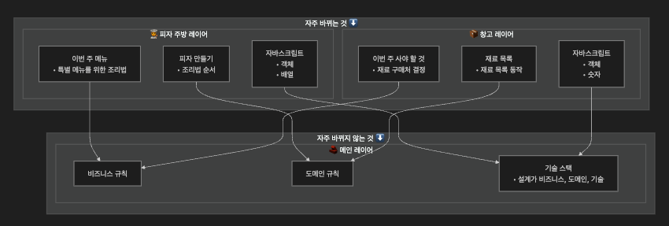
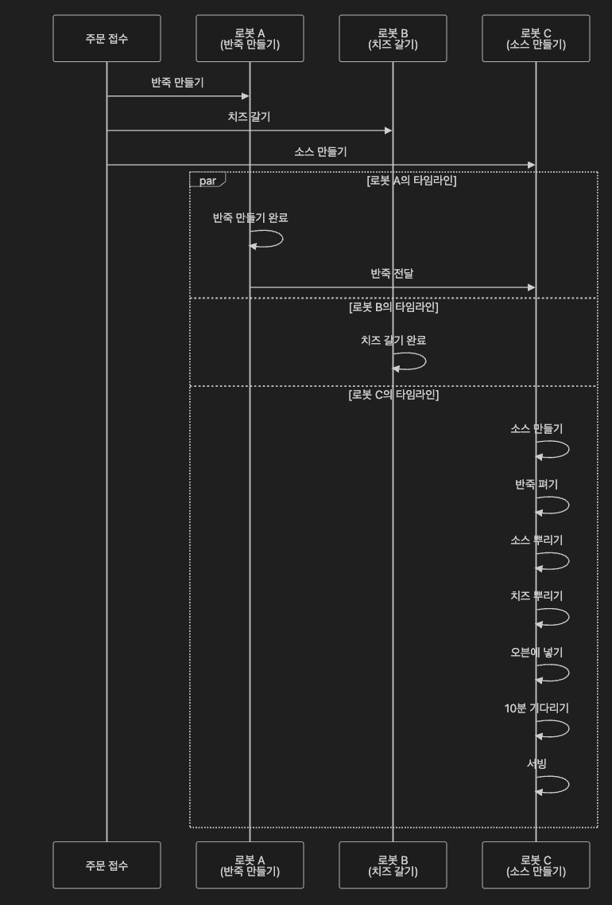

**함수형 프로그래밍의 뜻**

1. 수학 함수를 사용하고, 부수 효과(side effect)를 피하는 것이 특징인 프로그래밍 패러다임
2. 부수 효과 없이 순수 함수만 사용하는 프로그래밍 스타일

**부수 효과**

함수가 리턴값 이외에 하는 모든 일을 말함!

부수 효과는 함수를 부를 때 마다 발생하기 때문에, 어떤 경우에는 리턴값이 필요해서 불렀지만 의도하지 않게 부수효과가 발생할 수 있음.

**~~순수함수~~**

인자에만 의존하고, 부수 효과가 없는 함수.

같은 말로는 같은 인자를 넣으면, 항상 같은 결과를 돌려준다는 말!

부수 효과라고해서 뭔가 나빠보이지만, 함수형 프로그래머는 부수효과와 순수하지 않은 함수들을 사용하곤 한다!

### 실용적인 측면에서 함수형 프로그래밍 정의의 문제점

오잉 근데, `“수학 함수를 사용하고, 부수 효과(side effect)를 피하는 것이 특징인 프로그래밍 패러다임”` 이라면서요? 근데 부수효과와 순수하지 않은 함수를 사용한다고요?

네 맞습니다. 문제를 보죠

1. 부수효과는 필요하다.

   이메일을 전송하지 않는 이메일 전송 소프트웨어가 무슨 소용이 있을까?

2. 함수형 프로그래밍은 부수효과를 잘 다룰 수 있습니다.

   함수형 프로그래머는 부수효과가 문제가 될 수 있는 것을 알고, 부수효과를 잘 다루기 위한 도구를 많이 알고 있어야한다! 함수형 프로그래머라면 순수하지 않은 함수도 사용할 수 있어야한다!

즉, 이책에서는 일반적인 함수형 프로그래밍의 정의를 사용하지 않고, 좀 더 실용적인 함수형 프로그래밍을 보여주고, 함수형 프로그래밍의 진정한 아름다움은 코드 어느 곳에나 적용할 수 있다! 를 보여주고자 합니다.

### 액션, 계산, 데이터 구분하기

**액션과 계산, 데이터를 구분하는 것은 함수형 프로그래밍에서 기본개념이면서 핵심개념입니다!** 그에 따른 이점은 뭐가 있을까요?

**왜 나눠요?**

복잡한 소프트웨어가 필요하게 되면서, 함수형 프로그래밍이 다시금 각광 받게 되었는데, 여러 컴퓨터가 네트워크를 통해 통신하게 시작하면, 소프트웨어가 복잡하고 그에 따라 처리해야할 메세지가 중복되거나 유실되기도 합니다.

**1. 재사용성 향상**

- 계산(순수함수)은 어디서든 안전하게 재사용할 수 있습니다
- 부작용이 없어서 다른 곳에서 호출해도 예상치 못한 문제가 발생하지 않죠

**2. 테스트 용이성**

- 계산은 입력만 주면 항상 같은 결과가 나오므로 테스트하기 쉽습니다
- 액션은 별도로 격리해서 테스트할 수 있어서 전체적인 테스트 전략이 명확해집니다

**3. 이해하기 쉬운 코드**

- 함수를 봤을 때 이게 액션인지 계산인지 알면, 그 함수가 어떤 영향을 미치는지 바로 파악할 수 있습니다
- 계산은 "안전한" 함수이고, 액션은 "주의해서 다뤄야 할" 함수라는 걸 구분할 수 있죠

**4. 병렬 처리 가능**

- 계산은 서로 독립적이므로 동시에 실행해도 안전합니다.

# 액션, 계산, 데이터 비교표

| 구분       | 정의                                                                                                                                                                                                                                                                                                                                                                                                                                  | 특징                                                                                                                              |
| ---------- | ------------------------------------------------------------------------------------------------------------------------------------------------------------------------------------------------------------------------------------------------------------------------------------------------------------------------------------------------------------------------------------------------------------------------------------- | --------------------------------------------------------------------------------------------------------------------------------- |
| **액션**   | 실행 시점이나 횟수 또는 둘 다에 의존하는 것. 같은 메일을 오늘 보내는 것과 다음 주에 보내는 것은 완전히 다르다. 같은 메일을 10번 보내는 것과 한 번 보내는 것 또는 보내지 않는 것 역시 다르다.                                                                                                                                                                                                                                    | • 시간이 지남에 따라 안전하게 실행할 수 없는 방법 • 순서를 보장하는 방법 • 액션이 정확히 한 번만 실행되게 보장하는 방법     |
| **계산**   | 입력값으로 출력값을 만드는 것이다. 같은 입력값을 가지고 계산하면 항상 같은 결과값이 나온다. 언제, 어디서 계산해도 결과는 같고 외부에 영향을 주지 않는다. 계산은 테스트하기 쉽고 몇 번을 불러도 안전하다.                                                                                                                                                                                                                     | • 정확성을 위한 정적 분석 • 소프트웨어에서 쓸 수 있는 수학적 지식 • 테스트 전략                                             |
| **데이터** | 이벤트에 대한 기록한 사실을 나타낸다. 데이터는 실행하는 코드만큼 복잡하지 않기 때문에 다른 것과 구분된다. 하지만 알아보기 쉬운 속성으로 되어 있고 실행하지 않아도 데이터 자체로 의미가 있다. 또 같은 데이터를 여러 형태로 해석할 수 있다. 예를 들어 레스토랑에서 발행한 영수증 데이터가 있다고 한다. 관리자는 이 데이터를 인기있는 메뉴를 찾기 위해 쓸 수 있고, 고객은 외식비 지출 내역을 알아보기 위해 쓸 수 있다. | • 효율적으로 접근하기 위해 데이터를 구성하는 방법 • 데이터를 보관하기 위한 기술 • 데이터를 이용해 중요한 것을 발견하는 원칙 |

## 핵심 차이점

### 🎯 액션 (Actions)

- **의존성**: 시간, 실행 횟수에 의존
- **부작용**: 외부 세계에 영향을 줌
- **테스트**: 어려움 (모킹 필요)
- **예시**: API 호출, 파일 저장, 이메일 발송

### 🧮 계산 (Calculations)

- **의존성**: 입력값에만 의존
- **부작용**: 없음 (순수 함수)
- **테스트**: 쉬움 (입력-출력 검증)
- **예시**: 수학 계산, 문자열 처리, 정렬

### 📊 데이터 (Data)

- **의존성**: 없음 (불변 정보)
- **부작용**: 없음 (읽기 전용)
- **테스트**: 불필요 (단순 값)
- **예시**: 설정값, 상수, 객체 구조

## 2페이지 요약 (현실에서의 함수형 사고)

각 계층들은 그 아래에 있는 계층을 기반으로 만들어집니다. 그래서 각 계층에 있는 코드들은 더 안정적인 기반에 위치할 수 있습니다.

이러한 아키텍쳐 패턴 계층을 만들기 때문에, 계층형 설계라고 부르고

계층형 설계는 일반적으로 비즈니스 규칙, 도메인 규칙, 기술 스택 계층으로 나눕니다.

타임라인을 맞추지 않은 분산 시스템은 예측 불가능한 순서로 실행됩니다.

## 3페이지 요약 (액션과 계산 데이터의 차이를 알기)

### 분산 시스템은 그래서?

1. 타임라인은 실행 순서를 맞춰야한다.
2. 액션이 실행되는 시간은 중요하지 않다.
3. 타임라인은 항상 올바른 결과를 보장해야한다.
4. 타임라인 다이어그램을 통해서 시스템의 문제를 알 수 있다.

### 타임라인 커팅

서로가 서로의 작업이 기다릴 때까지 기다렸다가 실행함으로써

재료 준비하는 작업들의 실행 순서를 신경쓰지 않고, 피자 만드는 나머지 작업을 할 수 있습니다.

### 액션

실행 시점과 횟수에 의존하는 것

부수효과, 부수효과가 있는 함수, 순수하지 않은 함수 라고 부르기도 함.

ex) 이메일 보내기, 데이터 베이스 읽기

### 계산

입력으로 출력을 계산

다른 말로 순수함수, 수학 함수라고 부르기도 합니다.

ex) 최댓값 찾기, 이메일 주소가 올바른지 확인하기

### 데이터

이벤트에 대한 사실

ex) 사용자가 입력한 이메일 주소, 은행 AP로 읽은 달러 수량

## 액션, 계산, 데이터를 아래 단계별로 적용해보자!

### 1. 문제에 대해 생각할 때

문제를 특별히 주의해야 할 부분 (액션), 데이터로 처리해야할 부분, 결정을 내려야 하는 부분(계산)

을 명확히 알 수 있습니다!

### 2. 코딩할 때

최대한 액션에서 계산을 빼고, 또 계산에서 데이터를 분리할 수 있는지 생각해보자,

더 나아가 **액션이 계산이 될 수 있는지, 계산은 데이터가 될 수 있는지** 고민하자

### 3. 코드를 읽을 때

액션은 시간에 의존하기 때문에 조심해야하고, 언제나 숨어있는 액션까지도 찾아야한다!

---

## 데이터!!

### 데이터는 무엇인가요?

데이터는 이벤트에 대한 사실, 일어난 일의 결과.

### 데이터를 구현하는 방법

JS에서 기본 데이터 타입 숫자, 문자, 배열 등..

### 데이터의 의미를 담는 방법

데이터 구조로 의미를 담을 수 있다! 예를 들어 목록의 순서가 중요하다면 순서를 보장하는 데이터를 사용하면 되겠다!

### 불변성

함수형 프로그래머는 불변 데이터 구조를 위해서 두 가지 원칙을 사용합니다!

1. Copy-on-write : 변경할 때 복사본을 만든다.
2. defensive copy : 보관하려는 데이터의 복사본을 만든다.

해석은… 6,7장에서!

### 데이터의 장점!

1. 직렬화 : 직렬화된 데이터는 전송하거나 디스크에 저장했다가 읽기 쉽습니다.

🤭 직렬화 : 컴퓨터 과학의 데이터 스토리지 문맥에서 데이터 구조나 오브젝트 상태를 동일하거나 다른 컴퓨터 환경에 저장하고 나중에 재구성할 수 있는 포맷으로 변환하는 과정이다. (위키백과)

1. 동일성 비교하기 쉬움
2. 여러가지 방법으로 해석할 수 있음!

---

## 계산

### 정의!

입력값으로 출력값을 만들고, 실행 시점과 횟수에 관계없이 항상 같은 입력값에 대해 출력값을 돌려준다! (참조 투명성)

### 액션보다 계산이 좋은 이유

1. 테스트 용이성 (원하는 만큼 테스트 실행가능)
2. 기계적인 분석이 쉬움.
3. 조합하기 좋음. 계산을 조합해 더 큰 계산을 만들 수 있다.

### 계산을 쓰면서 걱정하지 않아도 되는것

1. 동시에 실행되는 것.
2. 과거에 실행되었던 것이나 미래에 실행할 것
3. 실행 횟수

---

## 액션

### 정의!

액션은 외부 세계에 영향을 주거나 받는 것!

실행 시점과 횟수에 의존하는 것!

- 언제 실행되는지 - 순서
- 얼마나 실행되는지 - 반복

### 액션은 쉽지 않다!

하지만 액션은 꼭 써야한다.

잘쓰려면?

1. 가능한 적게 사용해서 액션 대신 계산을 사용할 수 있는지 생각해봐야한다.
2. 액션은 가능한 적게 만든다. 액션에서 액션과 관련 없는 코드는 모두 제거한다. (1번이랑 일맥상통한듯?)
3. 액션이 외부 세계에 영향을 주고 받고가 가능하니, 가장 바깥쪽에는 액션 , 내부에는 계산과 데이터가 있는 구조가 가장 이상적이다!
4. 액션이 호출 시점에 의존하는 것을 제한합니다. 액션이 호출 시점과 횟수에 덜 의존하도록 만드는 기술을 공부해야한다!

액션은 퍼진다! 액션을 부르는 함수가 있다면 그 함수도 액션이되고, 작은 액션 하나가 코드 전체로 퍼져나가기에 액션을 가능한 조심스레 사용하려고 노력해야한다!

## 😀 서로 나눠봅시다!

서로의 생각을 나누면서 같이 적어보죠!

1. React 컴포넌트에서 액션과 계산을 어떻게 구분할 수 있을까?

2. useState, useEffect 훅들은 액션인가 계산인가?

3. API 호출을 하는 커스텀 훅은 어떻게 설계해야 할까?

4. 액션 부분을 최소화하고 계산 부분을 분리하는 방법은?

5. 상태 관리에서 불변성을 지키는 게 정말 성능상 이점이 있을까?

6. Copy-on-write가 실제 React 렌더링에 미치는 영향은?

7. 타입스크립트 타입 정의도 데이터의 의미를 담는 방법인가?

8. 런타임 검증과 컴파일 타임 검증의 역할 분담은?

9. 어디서 액션을 처리하고 어디서 계산을 해야 할까?

10. 테스트 코드 작성할 때 액션을 어떻게 격리해야 할까?

## 액션, 계산, 데이터 나누기 실습!

https://codesandbox.io/p/sandbox/wrl6yf
