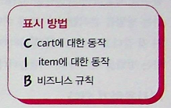

### MegaMart?

```javascript

var shopping_cart = []; <- 장바구니 제품과 금액 합계를 담고있는 전역변수
var shopping_cart_total = 0;

function add_item_to_cart(name, price) {
   shopping_cart.push({
       name: name,    <- 장바구니에 제품담기
       price: price
   });
   calc_cart_total(); <- 금액 합계 업데이트
}

function calc_cart_total() {
   shopping_cart_total = 0;
   for(var i = 0; i < shopping_cart.length; i++) {
       var item = shopping_cart[i];
       shopping_cart_total += item.price;
   }
   get_cart_total_dom();
}

```

### 개발팀 제나의 제안 (결제팀과 배송팀에서 shoping_cart_total을 사용하려고함)

- 전역변수에 의존하면 안됨
- DOM을 사용할 수 있는 곳에서 실행된다고 가정하면 안됨.
- 함수가 결괏값을 리턴해야 합니다.

### 함수에는 입력과 출력이 있습니다.

모든 함수는 입력과 출력이 있습니다! **입력은 함수가 계산을 하기위한 외부정보
출력은 함수 밖으로 나오는 정보나 어떤 동작!**

명시적 입력 : 함수가 필요한 모든 데이터를 매개변수로 직접 받는 것

명시적 입력 : 함수가 결과를 **return문으로만 반환**하는 것 (부수효과 없음)

암묵적 출력 : 함수가 **부수효과(side effect)를 일으키는** 것 (DOM 조작, 전역변수 변경 등)

암묵적 입력 : 함수가 **매개변수가 아닌 외부 데이터**에 의존하는 것

```javascript
var total = 0;
function add_to_total(amount) {
  //인자는 명시적 입력
  console.log("Old total: " + total); //전역변수를 읽는 것은 암묵적 출력
  total += amount; //전역변수 바꾸는거? 암묵적 출력
  return total;
}
```

### 서브루틴 추출하기

서브루틴 추출하기란? 코드의 일부분을 별도의 함수나 메소드로 분리하는 것입니다.

원래코드

```javascript
function calc_cart_total() {
  shopping_cart_total = 0;
  for (var i = 0; i < shopping_cart.length; i++) {
    var item = shopping_cart[i];
    shopping_cart_total += item.price;
  }
}

set_cart_total_dom();
update_shipping_icons();
update_tax_dom();
```

바꾼코드

```javascript
function calc_total() {
  set_cart_total_dom();
  update_shipping_icons();
  update_tax_dom();
}

function calc_total() {
  shopping_cart_total = 0;
  for (var i = 0; i < shopping_cart.length; i++) {
    var item = shopping_cart[i];
    shopping_cart_total += item.price;
  }
}
```

서브루틴 추출하기를 하기 위해선, 암묵적 입력과 출력을 찾아서, 분리해야한다!

암묵적 입력을 제거하고 함수에 인자를 추가하면 됨!

암묵적 출력을 제거하려면, 복사본을 변경하고 변경된 복사본을 리턴하게끔한다. => 만약 인자로 전달한 배열을 직접 변경하면 그 함수는 계산? 안계산?
안계산! 액션이다 -> 인자로 전달되는 값의 원본이 변경되기 때문에 어느 타이밍에 호출되는지에 따라 달라지니까 계산이 아니라 액션이된다!

### 계산 추출을 단계 별로 알아보기

1. 계산 코드를 찾아 빼내기 </br>
   빼낼 코드를 찾고, 새로운 함수를 만들어 리팩터링하기! 새 함수에 인자가 필요하다면 추가한다. 원래 코드에서 빼낸 부분에 새 함수를 부드도록 바꾸기

2. 새 함수에 암묵적 입력과 출력을 찾기! </br>
   암묵적 입력은 함수를 부르는 동안 결과에 영향을 주는 것이고, 암묵적 출력은 함수 호출의 결과로 영향을 받는 것.
   ex) 함수 인자를 포함해 함수 밖에 있는 변수를 읽거나 데이터베이스에서 값을 가져오는 것은 입력! 리턴값을 포함해 전역변수를 바꾸거나 공유 객체를 바꾸거나, 웹 요청을 보내는 것은 출력!

3. 암묵적 입력은 인자로 암묵적 출력은 리턴값으로 바꿉니다.</br>
   한 번에 하나씩 입력은 인자로 출력은 리턴값으로 바꾼다!
   여기서 인자와 리턴값은 바뀌지 않는 불변값이라는 것이 중요! 리턴값이 나중에 바뀐다면 암묵적 출력이고, 또 인자로 받은 값이 바뀔 수 있다면 암묵적 입력!

```javascript
function update_shipping_icons() {
  var buy_buttons = get_buy_buttons_dom();
  for (var i = 0; i < buy_buttons.length; i++) {
    var button = buy_buttons[i];
    var item = button.item;
    if (item.price + shopping_cart_total >= 20) {
      button.show_free_shipping_icon();
    } else {
      button.hide_free_shipping_icon();
    }
  }
}

//내답 오답
function update_shipping_icons() {
  var buy_buttons = get_buy_buttons_dom();
  for (var i = 0; i < buy_buttons.length; i++) {
    var button = buy_buttons[i];
    var item = button.item;
    calculatePrice(item.price, shopping_cart_total);
  }
}

function calculatePrice(price, total) {
  if (price + total >= 20) {
    button.show_free_shipping_icon();
  } else {
    button.show_free_shipping_icon();
  }
}
```

잘못된 이유

1. 잘못된 스코프 -> button이 어디서 났니..
2. 잘못된 조건문..
3. 제일 중요한건 계산과 돔조작을 같이하려고 했음.

### 연습문제

```javascript
// 전역 변수들
let current_user = { id: 1, name: "김철수", membership: "premium" };
let product_inventory = { laptop: 10, mouse: 25, keyboard: 15 };
let discount_rates = { premium: 0.2, regular: 0.1, none: 0 };

// 문제가 있는 함수들
function calculate_order_total(items) {
  let total = 0;

  for (let item of items) {
    if (product_inventory[item.name] < item.quantity) {
      update_error_message("재고가 부족합니다: " + item.name);
      return 0;
    }
    total += item.price * item.quantity;
    product_inventory[item.name] -= item.quantity; // 재고 차감
  }

  // 멤버십 할인 적용
  let user_discount = discount_rates[current_user.membership];
  total = total * (1 - user_discount);

  // 배송비 계산 (5만원 이상 무료배송)
  if (total < 50000) {
    total += 3000;
  }

  update_order_display(total);
  return total;
}

function update_error_message(message) {
  document.getElementById("error").textContent = message;
}

function update_order_display(total) {
  document.getElementById(
    "order-total"
  ).textContent = `총 금액: ${total.toLocaleString()}원`;
}
```

개선해야 할 점들:

암묵적 입력 제거: 전역 변수 의존성 제거 </br>
암묵적 출력 제거: 부수효과(DOM 업데이트, 전역 상태 변경) 분리 </br>
계산과 액션 분리: 순수 함수와 부수효과가 있는 함수 구분 </br>
함수 책임 분리: 각 함수가 하나의 명확한 책임만 가지도록 </br>

힌트:

재고 확인, 할인 계산, 배송비 계산을 각각 별도 함수로 분리 </br>
계산 함수들은 필요한 값을 모두 파라미터로 받도록 변경 </br>
DOM 업데이트는 별도 함수로 분리 </br>

## 5페이지 요약

### 비즈니스 요구 사항과 설계를 맞추기



전에 코드 예시들을 보다가 어지럼증을 느꼈는데, 이 표시방법을 보자마자 아하! 하면서 이해가됐습니다.

### 설계 원칙!

함수는 작으면 재사용하기 쉽고, 유지보수하기 쉽고, 테스트하기 쉽기 때문에 더 좋은 설계가 될 수 있다!

## 연습문제

# 계산 분류하기 연습 문제

## 📋 문제 설명

아래 함수들을 보고 각각이 어떤 계층에 속하는지 분류해보세요.

**분류 기준:**

- **C (Copy-on-write)**: 배열이나 객체를 복사하여 변경하는 함수
- **I (Item)**: 개별 아이템에 대한 동작을 하는 함수
- **B (Business)**: 비즈니스 로직이 담긴 함수
- **A (Array)**: 배열 전체를 다루는 함수

---

## 🔍 분류할 함수들

```javascript
// 함수 1
function remove_item_by_name(cart, name) {
  var new_cart = [];
  for (var i = 0; i < cart.length; i++) {
    if (cart[i].name !== name) {
      new_cart.push(cart[i]);
    }
  }
  return new_cart;
}

// 함수 2
function create_product(name, price, category) {
  return {
    name: name,
    price: price,
    category: category,
    created_at: new Date(),
  };
}

// 함수 3
function calculate_discount_price(original_price, discount_rate) {
  return original_price * (1 - discount_rate);
}

// 함수 4
function find_most_expensive_item(cart) {
  var max_item = cart[0];
  for (var i = 1; i < cart.length; i++) {
    if (cart[i].price > max_item.price) {
      max_item = cart[i];
    }
  }
  return max_item;
}

// 함수 5
function update_item_quantity(item, new_quantity) {
  return {
    name: item.name,
    price: item.price,
    quantity: new_quantity,
  };
}

// 함수 6
function get_items_by_category(cart, category) {
  var filtered_items = [];
  for (var i = 0; i < cart.length; i++) {
    if (cart[i].category === category) {
      filtered_items.push(cart[i]);
    }
  }
  return filtered_items;
}

// 함수 7
function calculate_bulk_discount(total_amount) {
  if (total_amount >= 100000) return 0.15; // 15% 할인
  if (total_amount >= 50000) return 0.1; // 10% 할인
  if (total_amount >= 20000) return 0.05; // 5% 할인
  return 0;
}

// 함수 8
function merge_carts(cart1, cart2) {
  var new_cart = cart1.slice();
  for (var i = 0; i < cart2.length; i++) {
    new_cart.push(cart2[i]);
  }
  return new_cart;
}

// 함수 9
function calculate_item_total(item) {
  return item.price * item.quantity;
}

// 함수 10
function sort_cart_by_price(cart) {
  var new_cart = cart.slice();
  new_cart.sort(function (a, b) {
    return b.price - a.price;
  });
  return new_cart;
}
```

---

## 🎯 문제

각 함수를 다음 중 하나로 분류하세요:

**A. Array 함수** - 배열 전체를 다루는 함수  
**B. Business 함수** - 비즈니스 로직이 담긴 함수  
**C. Copy-on-write 함수** - 배열이나 객체를 복사하여 변경하는 함수  
**I. Item 함수** - 개별 아이템에 대한 동작을 하는 함수

---

## 📝 답안 작성 양식

| 함수 번호 | 함수명                   | 분류 | 이유 |
| --------- | ------------------------ | ---- | ---- |
| 1         | remove_item_by_name      | ?    | ?    |
| 2         | create_product           | ?    | ?    |
| 3         | calculate_discount_price | ?    | ?    |
| 4         | find_most_expensive_item | ?    | ?    |
| 5         | update_item_quantity     | ?    | ?    |
| 6         | get_items_by_category    | ?    | ?    |
| 7         | calculate_bulk_discount  | ?    | ?    |
| 8         | merge_carts              | ?    | ?    |
| 9         | calculate_item_total     | ?    | ?    |
| 10        | sort_cart_by_price       | ?    | ?    |

---

## 💡 힌트

**Array 함수**를 찾을 때:

- 배열 전체를 순회하거나 조작하는가?
- 여러 아이템을 한 번에 처리하는가?

**Business 함수**를 찾을 때:

- 비즈니스 규칙이 포함되어 있는가?
- 도메인 특화된 로직인가?

**Copy-on-write 함수**를 찾을 때:

- 원본을 변경하지 않고 복사본을 만드는가?
- 불변성을 유지하는가?

**Item 함수**를 찾을 때:

- 개별 아이템이나 단순한 값만 다루는가?
- 배열과 무관하게 동작하는가?
