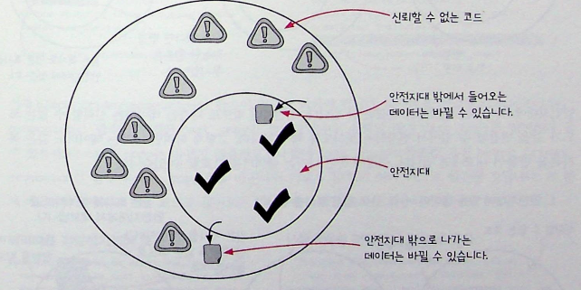

# 6장

### 들어가기전에 복습!

저희는 4,5과에서 액션에서 계산을 빼내는 연습들을 하고, 그 과정중에 불변성을 유지하면서 값을 바꾸는 것들을 적용을 했습니다.

그러면 왜 불변성을 지켜야 할까요?

**예측 가능한 데이터!**

데이터가 변경되지 않으면 함수의 동작을 예측하기 쉽고, 버그를 추적하기도 훨씬 간단합니다. 같은 입력에 대해 항상 같은 출력을 보장하는 순수함수를 만들 수 있죠.

**참조 투명성**

불변 데이터는 함수 호출을 그 결과값으로 안전하게 대체할 수 있게 해줍니다. 이는 코드 추론과 최적화에 매우 유용합니다.

카피-온-라이트가 결국에는 불변성을 지키는 것과 밀접한 관계가 있습니다.

### 카피온 라이트 원칙 세 단계

1. 복사본 만들기
2. 복사본 변경하기
3. 복사본 리턴하기

```jsx
function add_element_last(array, elem) {
  var new_array = array.slice();
  new_array.push(elem);
  return new_array;
}
```

1. 인자의 array가 배열을 변경하려고 하지만 원본은 변경 X
2. 복사본을 바꾸기 때문에 다른 코드에서 접근 X
3. 복사본을 return

그러면 add_element는 읽기? 쓰기?

데이터를 바꾸지 않고 정보를 리턴했기 때문에 쓰기!

### 카피온라이트로 쓰기를 읽기로 바꾸기

현재코드

```jsx
function remove_item_by_name(cart, name) {
  var idx = null;
  for (var i = 0; i < cart.length; i++) {
    if (cart[i].name === name) {
      idx = i;
    }
  }
  if (idx !== null) {
    cart.splice(idx, 1);
  }
}
```

개선된 코드

```jsx
function remove_item_by_name(cart, name) {
  var new_cart = cart.slice();
  var idx = null;
  for (var i = 0; i < cart.length; i++) {
    if (cart[i].name === name) {
      idx = i;
    }
  }
  if (idx !== null) {
    cart.splice(idx, 1);
  }
}
```

## 해결 과정

복사본을 만들고 아무것도 하지 않습니다. 다음 페이지에서 cart 인자를 복사한 값을 사용하도록 바꿔줍니다.

## 카피-온-라이트 규칙

1. 복사본 만들기
2. 복사본 변경하기(원본은 변경)
3. 복사본 리턴하기

</br>

## 쓰기를 하면서 읽기도 하는 동작은 어떻게 해야할까요?

카피-온-라이트에서 쓰기를 읽기로 바꿨습니다! 읽기라는 말은 값을 리턴한다는 의미지만, Shif 메서드는 이미 읽기입니다. 값을 리턴하고 있기 때문입니다.

두가지 카피 온 라이트 접근 방법을 봅시다

1. 읽기와 쓰기 함수로 각각 분리한다.
2. 함수에서 값을 두 개 리턴한다.

### 1. 쓰면서 읽기도 하는 함수를 분리하기

기존

```javascript
function drop_first(array) {
  array.shift();
}
```

수정

```javascript
function drop_first(array) {
  var array_copy = array.slice();
  array_copy.shift();
  return array_copy;
}
```

=> 이렇게 보면 얕은복사와 깊은복사가 떠오르기도 합니다 그쵸?

- 얕은 복사: 원본 배열을 직접 수정
- 깊은 복사: 원본 배열은 그대로 두고 복사본을 수정하여 반환

### 2. 값을 두 개 리턴하는 함수로 만들기

```javascript
function shift(array) {
  return array.shift();
}

//카피온 라이트
function shift(array) {
  var array_copy = array.slice();
  var first = array_copy.shift();
  return {
    first: first,
    array: array_copy,
  };
}

//두 값을 객체로 조합하기
function shift(array) {
  return {
    first: first_element(array),
    array: drop_first(array),
  };
}
```

개인적으로는 카피-온-라이트가 아니고 불변성이 유지되지 않으니까 1번이 더 괜찮은 방법이 아닐까? 라는 생각이 들었습니다.

### 변경 가능한 데이터를 읽는 것은 액션입니다.

- 변경 가능한 값을 읽을 때마다 다른 값을 읽을 수도 있습니다. 따라서 변경 가능한 데이터를 읽는 것은 액션입니다.

### 쓰기는 데이터를 변경 가능한 구조로 만듭니다.

- 쓰기는 데이터를 바꾸기 때문에 데이터를 변경 가능한 구조로 만듭니다.

### 어떤 데이터에 쓰기가 없다면 데이터는 변경 불가능한 데이터입니다.

- 쓰기가 모두 없었다면 데이터는 생성 이후 바뀌지 않습니다. 따라서 불변 데이터입니다.

### 불변 데이터 구조를 읽는 것은 계산입니다.

- 어떤 데이터를 불변으로 만들었다면 그 데이터에 모든 읽기는 계산입니다.

### 쓰기를 읽기로 바꾸면 코드에 계산이 많아집니다.

- 데이터 구조를 불변으로 만들수록 코드에 더 많은 계산이 생기고 액션은 줄어듭니다.

결론적으로는 "쓰기가 있으면" -> 모든 읽기가 액션이고
<br />"쓰기를 제거하면" -> 모든 읽기가 계산이 된다!
<br />그러니 쓰기를 제거하면 좀 더 함수형 프로그래밍에 가깝겠군요!

# 애플리케이션에는 시간에 따라 변하는 상태가 있습니다.

함수형 프로그래밍에 가깝게 했더니.. 모두 불변형으로 만들었는데..
모두 불변형이면 애플리케이션에서는 시간에 따라 변하는 상태를 어떻게 다뤄야할까~?

### 일반적인 오해

- 불변 데이터 구조는 변경 가능한 데이터 구조보다 메모리를 더 많이 쓰고 느리다는 인식
- 하지만 불변 데이터 구조를 사용하면서 대용량의 고성능 시스템을 구현하는 사례도 많이 있음

### 언제든 최적화할 수 있습니다

- 애플리케이션을 개발할 때 예상하지 않던 병목 지점이 항상 있음
- 그래서 성능 개선을 할 때는 병목 미리 최적화하지 말라고 함
- 불변 데이터 구조를 사용하고 속도가 느린 부분이 있다면 그때 최적화

### 가비지 컬렉터는 매우 빠릅니다

- 대부분의 언어에 있는 가비지 컬렉터는 성능 개선을 위해 꾸준히 연구됨
- 가비지 컬렉터는 한두 개의 시스템 명령어로 메모리를 비울 수 있을 만큼 최적화됨
- 우리는 이런 기술을 그냥 쓰면 됨

### 생각보다 많이 복사하지 않습니다

- 지금까지 만든 코드들을 잘 보면 그렇게 많이 복사하지 않았음
- 제품이 100개인 배열을 복사해도 참조만 복사함
- 데이터 구조의 최상위 단계만 복사하는 것을 **얕은 복사(shallow copy)**라고 함
- 값을 바꾸는 값은 메모리를 가리키는 참조에 대한 복사본을 만듦 (구조적 공유, structural sharing)

### 함수형 프로그래밍 언어에는 빠른 구현체가 있습니다

- 많은 함수형 언어는 직접 불변 데이터 구조를 만들어냄
- 하지만 어떤 함수형 프로그래밍 언어는 언어에서 불변 데이터 구조를 지원함
- 그리고 직접 만든 것보다 더 효율적으로 동작함
- 예: 클로저에서 지원하는 불변 데이터 구조는 다른 언어에서 참고할 만큼 효율적

객체의 얕은복사는 비슷한 내용이라 생략했습니다!

이거는 그에 관한 제 블로그 정리내용인데 도움이 되셨으면 좋겠습니다! ㅎㅎㅎ

## 결론

불변 데이터 구조는 실제로 효율적이고, 필요시 최적화 가능하며, 현대 기술들이 성능을 충분히 지원합니다. 그리고 하드웨어가 많이 좋아졌다보니, 좀 더 그 하드웨어에 의지해도 되지 않을까? 라는 생각도 듭니다 ㅎㅎ.

</br>
</br>
</br>
</br>
</br>
</br>
</br>

# 7장 신뢰할 수 없는 코드를 쓰면서 불변성 지키기

지금까지 카피-온-라이트를 적용해 불변성을 유지했지만 행사 떄문에 많은 곳에서 장바구니 데이터를 바꿔야하는 상황에 어떻게 해야할까
카피온라이트 원칙을 지키면서 안전하게 함수를 사용할 수 있는 원칙이 있는데 그것은 바로~ **방어적복사!**



불변성이 지켜지는 영역을 여기서는 안전지대라고 표현합니다. 하지만 카피 온 라이트 패턴으로는 안전지대에서만 놀 수 있고 블랙 프라이데이 함수의 입출력을 통해서 데이터의 입출력을 주고 받아야하는데, 결국에 방어적 복사는 깊은복사다~
</br>
신뢰할 수 없는 코드에 있는 데이터를 깊은복사 때리고, 깊은 복사한 데이터를 안전지대에서 내보내는 것!

## 방어적 복사 규칙

### 규칙1: 데이터가 안전한 코드에서 나갈 때 복사하기

변경 불가능한 데이터가 신뢰할 수 없는 코드로 나갈 때, 아래 단계로 원본 데이터를 보호할 수 있습니다.

1. 불변성 데이터를 위한 깊은 복사본을 만듭니다.
2. 신뢰할 수 없는 코드로 복사본을 전달합니다.

> **용어 설명**
>
> 깊은 복사(deep copy)는 원에서 아래로 모든 계층에 있는 충첩된 데이터 구조를 복사합니다.

### 규칙2: 안전한 코드로 데이터가 들어올 때 복사하기

신뢰할 수 없는 코드에서 넘겨받 수도 있는 데이터가 들어온다면 다음 단계를 따릅니다.

1. 변경될 수도 있는 데이터가 들어오면 바로 깊은 복사본을 만들어 안전한 코드로 전달합니다.
2. 복사본을 안전한 코드에서 사용합니다.

이 규칙을 따르면 불변성 원칙을 지키면서 신뢰할 수 있는 코드와 사용자왕한 수 있습니다.

첫 번째 규칙과 두 번째 규칙은 순서에 관계없이 쓸 수 있습니다. 어떤 경우는 먼저 데이터가 나가고 나중에 들어올 수도 있습니다. 신뢰할 수 없는 라이브러리의 함수를 사용할 때 그렇습니다. 반대로 먼저 데이터가 들어오고 나중에 나갈 수도 있습니다. 중요한 라이브러리를 만들 때 그렇습니다. 규칙은 어떤 순서로 적용해도 됩니다.

## 카피-온-라이트 vs 방어적 복사

| 구분               | 카피-온-라이트                                                            | 방어적 복사                                                                            |
| ------------------ | ------------------------------------------------------------------------- | -------------------------------------------------------------------------------------- |
| **언제 쓰나요?**   | 통제할 수 있는 데이터를 바꿀 때                                           | 신뢰할 수 없는 코드와 데이터를 주고받아야 할 때                                        |
| **어디서 쓰나요?** | 안전지대 어디서나 (불변성을 가진 안전지대를 만듦)                         | 안전지대의 경계에서 데이터가 오고 갈 때                                                |
| **복사 방식**      | 얕은 복사 (상대적으로 비용이 적음)                                        | 깊은 복사 (상대적으로 비용이 많음)                                                     |
| **규칙**           | 1. 바꿀 데이터의 얕은 복사를 만듦<br>2. 복사본을 변경<br>3. 복사본을 리턴 | 1. 안전지대로 들어오는 데이터에 깊은 복사<br>2. 안전지대에서 나가는 데이터에 깊은 복사 |

### 요점 정리

- 방어적 복사는 불변성을 구현하는 원칙입니다. 데이터가 들어오고 나갈 때 복사본을 만듭니다.

- 방어적 복사는 깊은 복사를 합니다. 그래서 카피-온-라이트보다 비용이 더 듭니다.

- 카피-온-라이트와 다르게 방어적 복사는 불변성 원칙을 구현하지 않은 코드로부터 데이터를 보호해 줍니다.

- 복사본이 많이 필요하지 않기 때문에 카피-온-라이트를 더 많이 사용합니다. 방어적 복사는 신뢰할 수 없는 코드와 함께 사용할 때만 사용합니다.

- 깊은 복사는 위에서 아래로 중첩된 데이터 전체를 복사합니다. 얕은 복사는 필요한 부분만 최소한으로 복사합니다.

https://velog.io/@carloskim/%EA%B9%8A%EC%9D%80-%EB%B9%84%EA%B5%90%EC%99%80-%EC%96%95%EC%9D%80-%EB%B9%84%EA%B5%90-%EB%A7%9B%EB%B3%B4%EA%B8%B0-%E4%B8%8A

이거는 얕은복사, 깊은복사, 얕은비교, 깊은비교를 탐구해보고 생각한 제 글인데요, 이걸 읽고나니 이책을 읽고 글을 썼으면 더 좋은 글을 쓸 수 있었겠구나 싶네요..!
