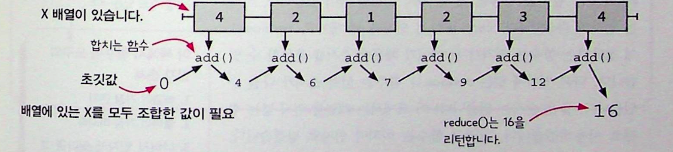

# 😎 12장 함수형 반복

앞에서 코드의 냄새를 발견하고, 리팩토링하는 부분들을 읽었습니다. 일급값, 고차함수 등을 사용해서 변수명, 함수에서 암묵적인 인자를 드러내고 리팩토링을 했는데요! 이번에는 어떤 내용이 있을지 확인해보시죠!

## ☕️ 함수형 도구 Array.map()

고차함수로 배열을 반복하는 forEach처럼 map도 반복하는데 forEach는 void! , map은 새로운 배열을 리턴합니다!

### 🔥 map 만들어보기!

```javascript
//배열과 함수를 인자로 받습니다.
function map(array, f) {
  //빈배열을 만듭니다.
  var newArray = [];
  //원래 배열 항목으로 새로운 항목을 만들기 위해 f()함수를 사용합니다.
  forEach(array, function (element) {
    //원래 배열에 해당하는 항목에 새로운 항목을 추가합니다.
    newArray.push(f(element));
  });
  //새로운 배열을 리턴합니다.
  return newArray;
}
```

map은 매우 유용하지만, 리턴값인 배열에 들어 있는 항목을 확인하지 않기 때문에, undefined나 Null을 리턴하게 되었을 때 위험할 수 있습니다!

## 함수형 도구 Array.filter()

새로운 배열을 리턴하는데, 남길 배열을 선택해서 남길 수 있습니다! 원래 배열의 순서는 유지하되 어떤 항목은 건너뛰는거죠!

### 🔥 map 만들어보기!

```javascript
//배열과 함수를 인자로 받습니다.
function filter(array, f) {
  //빈배열을 만듭니다.
  var newArray = [];
  //원래 배열 항목으로 새로운 항목을 만들기 위해 f()함수를 사용합니다.
  forEach(array, function (element) {
    if (f(element)) {
      //f를 넣어 항목을 결과 배열에 넣을지 말지 확인합니다.
      newArray.push(f(element));
    }
  });
  //새로운 배열을 리턴합니다.
  return newArray;
}
```

## 함수형 도구 Array.reduce()

배열을 순회하면서 값을 누적합니다! 근데 누적은 추상적이라 여러가지 형태가 될 수 있죠! 예를 들어 값을 더하거나, 문자열을 합치거나 여러가지 누적하는 방법들을 결정할 수 있습니다.

### 🔥 map 만들어보기!

```javascript
//배열, 초깃값, 함수를 인자로 받습니다.
function reduce(array, init, f) {
  var accum = init;
  //누적된 값을 초기화합니다.
  forEach(array, function (element) {
    //누적 값을 계산하기 위해 현재 값과 배열 항목으로 f항목을 부릅니다.
    accum = f(accum, element);
  });
  //누적된 배열을 리턴합니다.
  return accum;
}
```



**❗️조심할점**
</br>
reduce 함수를 사용할 때 두 가지 질문에 답해야합니다.

1. 계산이 어떤 값에서 시작되는가? 더하기를 한다면 0, 곱하기를 한다면 1이 되겠죠? 초깃값을 잘 설정해야합니다.
2. 배열이 비어 있다면 어떤 값을 리턴할 것인가? 빈 문자열 배열을 사용한다면 합친 문자열 결과는 빈 문자열이어야겠죠?
