# 15장 타임라인 격리하기

전에 했었던 타임라인 다이어그램.. 기억이나는데요? 이해하기 조금 어려웠던 기억이 나네요! 공유하는 자원을 줄여서 코드 설계하는 방법을 알아봅시다!

## 🐛 버그가 있습니다!

장바구니에 물건들을 담는데, 그냥 클릭하면 괜찮은데 빠르게 두 번 클릭하니까 가격이 이상하잖아?.. 왜그럴까요?

아래 코드를 봅시다.

```javascript
function add_item_to_cart(name, price, quantity) {
  // 사용자가 장바구니에 추가 버튼을 클릭하면 실행되는 함수입니다.
  cart = add_item(cart, name, price, quantity);
  calc_cart_total(); // 장바구니 전역변수을 읽고 씁니다.
}

function calc_cart_total() {
  // 전체 API로 AJAX 요청을 보냅니다.
  total = 0;
  cost_ajax(cart, function (cost) {
    // 요청이 완료될 때 실행되는 콜백
    total += cost;
    shipping_ajax(cart, function (shipping) {
      // 판매 API로 AJAX 요청을 보냅니다.
      total += shipping; // 판매 API 응답이 오면 실행되는 콜백
      update_total_dom(total); // 합계를 DOM에 반영합니다.
    });
  });
}
```

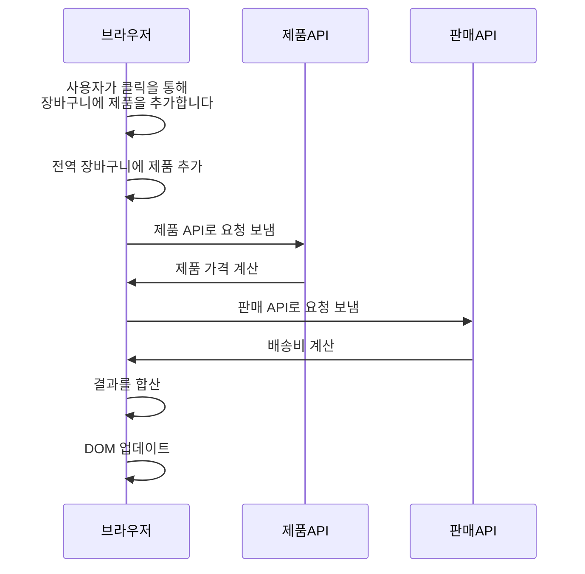

코드를 보나, 유스케이스를 보나 큰 문제는 없어보입니다. 그런데도 문제는 발생하죠?
타임라인을 통해서 한 번 확인해봅시다.

## ⌚️ 타임라인 다이어그램은 시간에 따라 어떤일이 일어나는지 보여줍니다.

이 그림은 Mermaid로 표현하기 어려워서 스크린샷을 찍어보았습니다..ㅎㅎ 지금 아래에 여기가 문제입니다! 라고 쓰여있는 부분을 보면 total을 읽고 쓰는부분이 순서대로 되고 있지 않습니다!
어떤 문제가 있는지 알아봅시다!

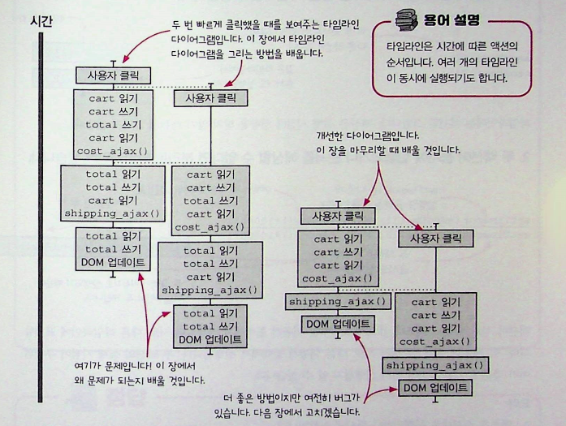

### 두 가지 타임라인 다이어그램 기본 규칙

타임라인 다이어그램으로 알 수 있는 중요한 두 가지 사실이 있는데, 순서대로 실행되는 액션과 동시에 나란히 실행되는 액션입니다. 두 종류의 액션을 시각화해서 문제가 있는지 알 수 있습니다.

#### 1. 두 액션이 순서대로 나타나면 같은 타임라인에 넣습니다.

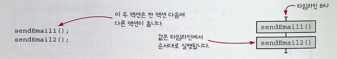
계산은 실행 시점에 영향을 받지 않기 때문에 타임라인에는 액션만 그립니다.

#### 2. 두 액션이 동시에 실행되거나 순서를 예상할 수 없다면 분리된 타임라인에 넣습니다.

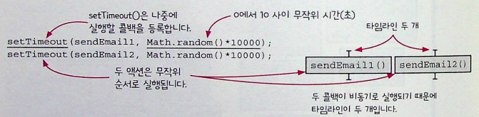
액션이 서로 다른 스레드, 프로세스, 기계, 비동기 콜백에서 실행되면 서로 다른 타임라인에 표시합니다. 이 경우는 액션 두 개가 서로 다른 비동기 콜백에서 실행됩니다. 두 액션의 실행 시점이 무작위이기 때문에 어떤 액션이 먼저 실행될지 알 수 없습니다.

예제 문제를 풀어보셨다면 좀 더 이해가 쉬울 수 있습니다!

## 🍻 자세히 보면 놓칠 수 있는 액션 순서에 관한 두 가지 사실

타임라인 다이어그램을 그릴 때 언어의 실행 방법이 중요한 부분이기 때문에 자바스크립트의 실행방법을 한 번 살펴 보죠?

### 1. ++와 +=는 사실 세 단계입니다.

자바스크립트에서 이 연산자로 짧고 쉽게 쓰기를 할 수 있지만, 이 연산자에는 세 단계로 연산을 한다는 사실이 숨어있습니다.

```javascript
total++; //단일 연산자이지만 세 단계로 실행됩니다.

var temp = total; //읽기(액션)
temp = temp + 1; //더하기(계산)
total = temp; //쓰기(액션)
```

모두 세 단계로 되어 있습니다. 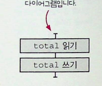
더하기가 없는 이유는 타임라인 다이어그램 그릴 때는 계산을 뺀다고 했습니닷!!

### 2. 인자는 함수를 부르기 전에 실행합니다.

만약 함수에 인자를 전달하면서 실행한다면, 인자는 함수에 전달되기 전에 실행됩니다. 이 부분도 타임라인 다이어그램을 그릴 때 순서대로 표현되어야 합니다.

```javascript
console.log(total);

//전역변수인 total 값을 로그에 남깁니다. 실행 순서를 자세히 보기위해 아래 같은 코드로 바꿔봅시다.

var temp = total;
console.log(temp);
```

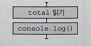 전역변수를 읽는 것을 명확히 알 수 있습니다.

## 😙 타임라인 그리기

타임라인 다이어그램 그릴 때 순서대로 실행되는 것과 동시에 실행되는 액션이 있다는 사실을 알았습니다!
타임라인 다이어그램은 세 단계로 그릴 수 있습니다.

1. 액션을 확인합니다.
2. 순서대로 실행되거나 동시에 실행되는 액션을 그립니다.
3. 플랫폼에 특화된 지식을 사용해 다이어그램을 단순하게 만듭니다.

## 1. 액션 확인하기

```javascript
function add_item_to_cart(name, price, quantity) {
  cart = add_item(cart, name, price, quantity);
  calc_cart_total(); // 전체내용을 읽고 봅니다.
}

function calc_cart_total() {
  // 장바구니를 읽고
  total = 0; // cost_ajax()를 호출합니다.
  cost_ajax(cart, function (cost) {
    total += cost;
    shipping_ajax(cart, function (shipping) {
      total += shipping;
      update_total_dom(total); // total을 읽고 봅니다.
    });
  });
}
```

액션 순서:

cart 읽기 ->
cart 쓰기 ->
total = 0 쓰기 ->
cart 읽기 ->
cost_ajax() 부르기 ->
total 읽기 ->
total 쓰기 ->
cart 읽기 ->
shipping_ajax() 부르기 ->
total 읽기 ->
total 쓰기 ->
total 읽기 ->
update_total_dom() 부르기

이 짧은 코드에 13개의 액션이 있으면서, 동시에 비동기 콜백도 두개가 있습니다.

### 비동기 호출은 새로운 타임라인으로 그립니다.

ajax요청과 같은 비동기 콜백은 새로운 타임라인에 표시해야합니다.
자바스크립트는 입출력의 결과는 콜백으로 받을 수 있지만, 언제 끝날지 알 수 없기 때문에 다른 타임라인에 표현해야합니다.
취준시절에 이벤트 루프 동영상도 많이보고, 달달 외우고 그랬던 시절이 떠오르는군요 하하하

### 한 단계씩 타임라인 만들기

한 단계씩 만들어봅시다!

```javascript
saveUserAjax(user, function () {
  setUserLoadingDOM(false);
});
setUserLoadingDOM(true);
saveDocumentAjax(document, function () {
  setDocLoadingDOM(false);
});
setDocLoadingDOM(true);
```

#### 액션

1. saveUserAjax()
2. setUserLoadingDOM(false)
3. setUserLoadingDOM(true)
4. saveDocumentAjax()
5. setDocLoadingDOM(false)
6. setDocLoadingDOM(true)

간단히 요약하자면 콜백, api요청등의 비동기 함수들은 새로운 타임라인을 그려서 만든다! 마지막만 캡쳐해봤습니다!
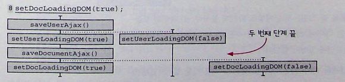

## 😎 2. 순서대로 실행되거나 동시에 실행되는 액션 그리기

모든 액션을 확인했는데용?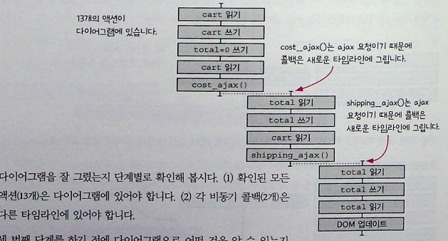
비동기 콜백이 각자 다른 타임라인에 잘 있는지 확인해봅시다!
음.. 잘있군요?

### 타임라인 다이어그램으로 순서대로 실행되는 코드에는 두 가지 종류가 있다!

일반저긍로 순서대로 실행되는 두 액션 사이에 다른 타임라인에 있는 액션이 끼어들 수 있는데, 어떤 환경에선는 그럴 수 없습니다. (JS 같은 경우 싱글 스레드여서 다른 액션이 낄 수 없음) 순서대로 실행되지만 순서가 섞일 수 있는 코드, 그렇지 않은 코드 둘 다 타임라인 다이어그램으로 표현할 수 있습니다.

1. 순서가 섞일 수 있는 코드
   두 액션 사이에 시간이 얼마나 걸릴지 알 수 없습니다. 액션은 박스로 표시하고, 액션사이에 걸리는 시간은 선으로 표시합니다.액션사이 걸리는 시간에 따라서 선을 조절 할 수 었습니다. 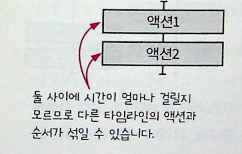

2. 순서가 섞이지 않는 코드
   어떤 경우에는 두 액션이 차례로 실행되는데 그사이에 다른 작업이 끼어들지 못합니다.
   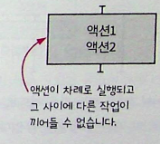
   이렇게 그릴 수 있습니다.

두 타임라인은 서로 다르게 실행됩니다.
1번처럼 순서가 섞일 수 있게 짧은 타임라인이 좀 더 관리하기 쉽습니다.

타임라인 다이어그램은 순처적으로 실행되는 코드뿐만 아니라 동시에 실행되는 코드를 표현할 수 도 있습니다.
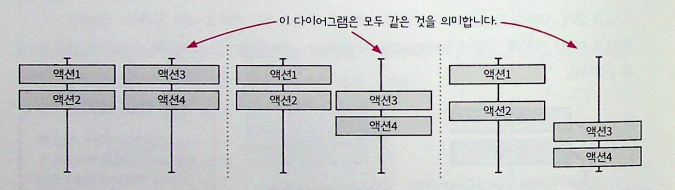

이 세 개의 다이어그램은 모두 같은 것을 의미합니다. 또 실행 가능한 순서는 문제가 될 수 있기 때문에 예상할 수 있어야합니다.

### 좋은 타임라인 원칙

#### 1. 타임라인은 적을수록 이해하기 쉽다!

타임라인이 하나라면 모든 액션은 앞의 액션 다음에 바로 실행됩니다. 멀티스레드, 비동기 콜백, 등을 사용하려면 새로운 타임라인이 필요합니다.
새로운 타임라인은 항상 시스템을 이해하기 어렵게 만들지만, 마음대로 조정할 수는 없습니다.

#### 2. 타임라인은 짧을수록 이해하기 쉽다!

단계를 줄이면 실행 가능한 순서도 많이 줄일 수 있어서 이해하기 쉽습니다.

#### 3. 공유하는 자원이 적을수록 이해하기 쉽습니다.

서로 다른 타임라인에 있는 두 액션이 서로 자원을 공유하지 않는다면 실행 순서에 신경 쓸 필요가 없어서 이해하기 쉬워집니다.

### 4. 자원을 공유한다면 서로 조율해야 합니다.

공유 자원을 많이 없앤다고 해도 여전히 없앨 수 없는 공유 자원이 남습니다. 타임라인간 조율은 올바른 결과를 주지 않는 실행 순서를 없애는 것을 말합니다.

### 5. 시간을 일급으로 다룹니다.

액션의 순서와 타이밍을 맞추는 것은 어렵기 떄문에 타임라인을 다루는 재사용 가능한 객체를 만들면 타이밍 문제로 쉽게 만들 수 있습니다.

## 자바스크립트의 스레드, 이벤트루프 , ajax는... 생략입니다!

### 타임라인 단순화하기

### 1. 하나의 타임라인에 있는 모든 액션을 하나로 통합합니다.

JS는 스레드가 하나이기 때문에 액션은 순서가 섞이지 않고 하나의 타임라인에서 실행됩니다. 타임라인은 다른 타임라인이 실행되기 전에 완료됩니다.
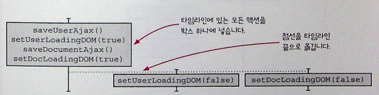

### 2. 타임라인이 끝나는 곳에서 새로운 타임라인이 하나만 생긴다면 통합합니다.

첫 번째 타임라인이 끝나는 곳에 새로운 타임라인이 두 개 생기기 때문에 통합하지 않습니다.

</br>

# 😉 타임라인 그리기 요약!

## 액션을 확인하기

모든 액션은 타임라인에 표시되어야 한다. 복합적인 액션도 있으므로 변수를 읽고 쓰는 것처럼 하나의 액션처럼 보이지만 여러 액션으로 되어 있는 액션을 하나의 액션으로 파악하기 위해 주의 깊게 봐야 한다. ++나 +=는 하나의 액션처럼 생겼지만 실제로는 복합적 액션으로 되어 있다.

### 액션을 그리기

액션은 순서대로 실행되나 동시에 실행 될 수 있다.

### 순서대로 실행되는 액션: 하나가 끝나고 다음이 시작

순서대로 실행되는 액션은 같은 타임라인에 표시한다. 함수의 인자가 왼쪽에서 오른쪽으로 평가되는 것처럼 순서대로 실행되는 액션은 문법에 있을 수도 있다.

### 동시에 실행되는 액션: 동시에 실행되거나 왼쪽 먼저 또는 오른쪽 먼저 실행

동시에 실행되거나 순서가 섞여서 실행되는 경우 분리된 타임라인으로 표시한다. 다음과 같이 다양한 경우에 액션이 동시에 실행될 수 있다.

- 비동기 콜백
- 멀티 프로세스
- 멀티스레드
- 여러 장치

모든 액션을 그린 후, 실행 순서를 계산하기 위해 점선을 사용할 수 있다. 예를 들어 ajax 콜백은 ajax 요청 전에 실행할 수 없다. <- 요런걸 점선으로 표현

## 타임라인을 단순화하기

언어의 특징을 사용해서 타임라인을 단순화할 수 있다.

- 순서가 섞이지 않는 두 액션은 하나의 박스로 합친다.
- 타임라인 끝에서 새로운 타임라인이 하나만 생긴다면 하나로 합친다.
- 순서에 제약이 있는 경우 점선을 추가한다.

## 타임라인 읽기

일반적으로 서로 다른 타임라인에 있는 액션은 세 가지 순서로 실행될 수 있다. 동시에 실행되거나 왼쪽이 먼저 실행되거나 오른쪽이 먼저 실행될 수 있다. 어떤 경우 실행 순서는 불가능하거나 기대한 대로이거나 잘못된 결과를 가져올 수 있다.

## 문제를 찾아볼까요?!

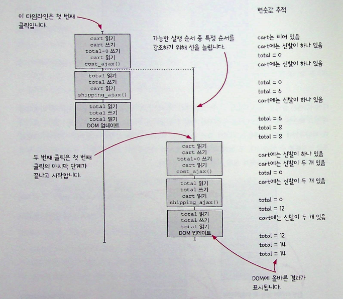
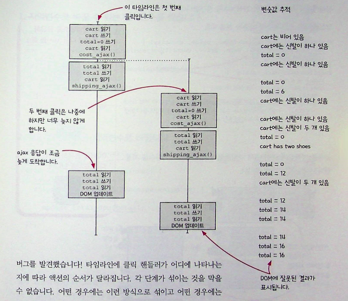

클릭핸들러가 어디에 있느냐에 따라서 액션의 순서가 달라집니다. 각 단계가 섞이는 것을 막을 수는 없습니다. 이 코드를 잘 동작하게 하려면 어떤 방법이 있을까요?

### 전역변수를 지역변수로 바꾸기

```javascript
function add_item_to_cart(name, price, quantity) {
  cart = add_item(cart, name, price, quantity);
  calc_cart_total();
}

function calc_cart_total() {
  total = 0;
  cost_ajax(cart, function (cost) {
    total += cost;
    shipping_ajax(cart, function (shipping) {
      total += shipping;
      update_total_dom(total);
    });
  });
}

//여기서 cart와 total은 전역변수인데, 모든 단계에서 total 값을 사용하기 떄문에 버그가 생길 수 있습니다.

function calc_cart_total() {
  var total = 0; // 지역변수로 바꿉니다.
  cost_ajax(cart, function (cost) {
    total += cost;
    shipping_ajax(cart, function (shipping) {
      total += shipping;
      update_total_dom(total);
    });
  });
}
```

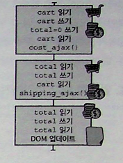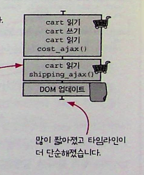
타임라인이 많이 짧아졌습니다! 더 안전하게 쓰려면 var 보다는 let을 사용하는게 좋겠죠? (var는 블록 밖에서도 접근 가능하기 때문에 호이스팅이 일어나서 안전하지 않게 사용될 수 있기 때문.)

### 전역변수를 인자로 바꾸기

```javascript
function add_item_to_cart(name, price, quantity) {
  cart = add_item(cart, name, price, quantity);
  calc_cart_total(cart);
}

function calc_cart_total(cart) {
  var total = 0; // cart를 인자로 만들어서 전역변수에 접근하지 않게 만들었습니다.
  cost_ajax(cart, function (cost) {
    total += cost;
    shipping_ajax(cart, function (shipping) {
      total += shipping;
      update_total_dom(total);
    });
  });
}
```

</br>
</br>
</br>
</br>

# 타임라인과 비동기 처리 문제

## 문제 1: 타임라인 분석 (난이도: ⭐⭐)

다음 코드에서 실행 순서를 타임라인으로 분석하고, 어떤 문제가 발생할 수 있는지 설명하세요.

```javascript
function processOrder() {
  console.log("1. 주문 시작");

  setTimeout(() => {
    console.log("2. 결제 처리");
  }, 100);

  setTimeout(() => {
    console.log("3. 재고 확인");
  }, 50);

  console.log("4. 주문 완료");
}
```

**질문:**

- 실제 출력 순서는?
- 두 개의 타임라인으로 어떻게 나누어질까요?
- 어떤 문제가 발생할 수 있나요?

<details>
<summary>👆 답안 보기</summary>

**실제 출력 순서:**

```
1. 주문 시작
4. 주문 완료
3. 재고 확인
2. 결제 처리
```

**타임라인 분석:**

- **메인 타임라인**: `console.log('1. 주문 시작')` → `console.log('4. 주문 완료')`
- **비동기 타임라인**: `setTimeout(50ms)` → `setTimeout(100ms)`

**발생 가능한 문제:**

1. **논리적 순서 문제**: "주문 완료"가 결제와 재고 확인 전에 출력됨
2. **사용자 혼란**: 실제로는 주문이 완료되지 않았는데 완료 메시지가 먼저 표시
3. **데이터 불일치**: 결제나 재고 확인 실패 시에도 "완료" 상태로 표시될 수 있음

**개선 방안:**

```javascript
async function processOrder() {
  console.log("1. 주문 시작");

  try {
    await new Promise((resolve) =>
      setTimeout(() => {
        console.log("3. 재고 확인");
        resolve();
      }, 50)
    );

    await new Promise((resolve) =>
      setTimeout(() => {
        console.log("2. 결제 처리");
        resolve();
      }, 100)
    );

    console.log("4. 주문 완료");
  } catch (error) {
    console.log("주문 실패:", error);
  }
}
```

</details>

---

## 문제 2: 콜백 헬 리팩토링 (난이도: ⭐⭐⭐)

다음 콜백 헬 코드를 async/await와 적절한 에러 처리를 사용해 개선하세요.

```javascript
function getUserData(userId) {
  let userData = {};

  fetchUser(userId, function (user) {
    userData.user = user;
    fetchUserPosts(userId, function (posts) {
      userData.posts = posts;
      fetchUserComments(userId, function (comments) {
        userData.comments = comments;
        updateUserProfile(userData, function (result) {
          console.log("완료:", result);
        });
      });
    });
  });
}
```

**요구사항:**

- Promise 또는 async/await 사용
- 적절한 에러 처리 추가
- 가독성과 유지보수성 개선
- 병렬 처리 가능한 부분은 병렬로 처리

<details>
<summary>👆 답안 보기</summary>

**1단계: Promise 체인으로 개선**

```javascript
function getUserData(userId) {
  let userData = {};

  return fetchUser(userId)
    .then((user) => {
      userData.user = user;
      return fetchUserPosts(userId);
    })
    .then((posts) => {
      userData.posts = posts;
      return fetchUserComments(userId);
    })
    .then((comments) => {
      userData.comments = comments;
      return updateUserProfile(userData);
    })
    .then((result) => {
      console.log("완료:", result);
      return result;
    })
    .catch((error) => {
      console.error("사용자 데이터 로딩 실패:", error);
      throw error;
    });
}
```

**2단계: async/await로 개선**

```javascript
async function getUserData(userId) {
  try {
    const user = await fetchUser(userId);

    // 병렬 처리 가능한 부분을 동시 실행
    const [posts, comments] = await Promise.all([
      fetchUserPosts(userId),
      fetchUserComments(userId),
    ]);

    const userData = {
      user,
      posts,
      comments,
    };

    const result = await updateUserProfile(userData);
    console.log("완료:", result);
    return result;
  } catch (error) {
    console.error("사용자 데이터 로딩 실패:", error);
    throw error;
  }
}
```

**3단계: 에러 처리 세분화**

```javascript
async function getUserData(userId) {
  if (!userId) {
    throw new Error("사용자 ID가 필요합니다");
  }

  try {
    const user = await fetchUser(userId);
    if (!user) {
      throw new Error("사용자를 찾을 수 없습니다");
    }

    // 병렬 처리 with 개별 에러 처리
    const [posts, comments] = await Promise.allSettled([
      fetchUserPosts(userId),
      fetchUserComments(userId),
    ]);

    const userData = {
      user,
      posts: posts.status === "fulfilled" ? posts.value : [],
      comments: comments.status === "fulfilled" ? comments.value : [],
    };

    // 부분적 실패 로깅
    if (posts.status === "rejected") {
      console.warn("게시물 로딩 실패:", posts.reason);
    }
    if (comments.status === "rejected") {
      console.warn("댓글 로딩 실패:", comments.reason);
    }

    const result = await updateUserProfile(userData);
    console.log("완료:", result);
    return result;
  } catch (error) {
    console.error("사용자 데이터 로딩 실패:", error);
    throw new Error(`사용자 데이터 로딩 중 오류 발생: ${error.message}`);
  }
}
```

**개선 포인트:**

- ✅ 콜백 헬 제거로 가독성 향상
- ✅ 병렬 처리로 성능 개선
- ✅ 세분화된 에러 처리
- ✅ 부분적 실패 허용 (댓글/게시물 실패해도 사용자 정보는 표시)

</details>

---

## 문제 3: 경쟁 상태(Race Condition) 해결 (난이도: ⭐⭐⭐⭐)

다음 코드에서 발생할 수 있는 경쟁 상태를 찾고 해결하세요.

```javascript
let currentRequestId = 0;

function searchProducts(query) {
  const requestId = ++currentRequestId;

  // API 호출 (응답 시간이 다를 수 있음)
  fetchProductsAPI(query).then((products) => {
    displayProducts(products);
  });
}

// 사용자가 빠르게 검색어를 입력하는 경우
searchProducts("자바"); // 1번 요청 (늦게 응답)
searchProducts("자바스크립트"); // 2번 요청 (빨리 응답)
```

**질문:**

- 어떤 문제가 발생할 수 있나요?
- 이를 해결하는 방법은?
- AbortController를 사용한 해결책을 제시하세요.

<details>
<summary>👆 답안 보기</summary>

**발생 가능한 문제:**

1. **잘못된 결과 표시**: "자바스크립트" 검색 결과가 먼저 와서 표시된 후, "자바" 결과가 늦게 와서 덮어씀
2. **사용자 혼란**: 최신 검색어와 다른 결과가 표시됨
3. **리소스 낭비**: 불필요한 네트워크 요청과 DOM 업데이트

**해결 방법 1: 요청 ID로 최신성 확인**

```javascript
let currentRequestId = 0;

function searchProducts(query) {
  const requestId = ++currentRequestId;

  fetchProductsAPI(query).then((products) => {
    // 최신 요청인지 확인
    if (requestId === currentRequestId) {
      displayProducts(products);
    }
    // 오래된 요청이면 무시
  });
}
```

**해결 방법 2: AbortController 사용**

```javascript
let currentController = null;

function searchProducts(query) {
  // 이전 요청 취소
  if (currentController) {
    currentController.abort();
  }

  // 새 요청을 위한 컨트롤러 생성
  currentController = new AbortController();

  fetchProductsAPI(query, {
    signal: currentController.signal,
  })
    .then((products) => {
      displayProducts(products);
    })
    .catch((error) => {
      if (error.name !== "AbortError") {
        console.error("검색 오류:", error);
      }
    });
}
```

**해결 방법 3: 디바운스 + AbortController (최적화)**

```javascript
class SearchManager {
  constructor(delay = 300) {
    this.delay = delay;
    this.timeoutId = null;
    this.controller = null;
  }

  async search(query) {
    // 이전 타이머 취소
    if (this.timeoutId) {
      clearTimeout(this.timeoutId);
    }

    // 이전 요청 취소
    if (this.controller) {
      this.controller.abort();
    }

    return new Promise((resolve, reject) => {
      this.timeoutId = setTimeout(async () => {
        try {
          this.controller = new AbortController();

          const products = await fetchProductsAPI(query, {
            signal: this.controller.signal,
          });

          displayProducts(products);
          resolve(products);
        } catch (error) {
          if (error.name !== "AbortError") {
            console.error("검색 오류:", error);
            reject(error);
          }
        }
      }, this.delay);
    });
  }
}

// 사용법
const searchManager = new SearchManager(300);

function searchProducts(query) {
  return searchManager.search(query);
}
```

**해결 방법 4: React Hook 패턴**

```javascript
function useSearch() {
  const [results, setResults] = useState([]);
  const [loading, setLoading] = useState(false);
  const abortControllerRef = useRef(null);

  const search = useCallback(async (query) => {
    // 이전 요청 취소
    if (abortControllerRef.current) {
      abortControllerRef.current.abort();
    }

    if (!query.trim()) {
      setResults([]);
      return;
    }

    abortControllerRef.current = new AbortController();
    setLoading(true);

    try {
      const products = await fetchProductsAPI(query, {
        signal: abortControllerRef.current.signal,
      });

      setResults(products);
    } catch (error) {
      if (error.name !== "AbortError") {
        console.error("검색 오류:", error);
        setResults([]);
      }
    } finally {
      setLoading(false);
    }
  }, []);

  // 컴포넌트 언마운트 시 정리
  useEffect(() => {
    return () => {
      if (abortControllerRef.current) {
        abortControllerRef.current.abort();
      }
    };
  }, []);

  return { results, loading, search };
}
```

**핵심 해결 전략:**

- ✅ **요청 취소**: AbortController로 불필요한 요청 중단
- ✅ **디바운스**: 연속 입력 시 요청 횟수 제한
- ✅ **최신성 검증**: 응답 순서와 관계없이 최신 요청만 처리
- ✅ **리소스 정리**: 메모리 누수 방지

</details>

---

## 문제 4: 실무 시나리오 - 장바구니 동시성 처리 (난이도: ⭐⭐⭐⭐⭐)

온라인 쇼핑몰에서 다음 시나리오가 발생합니다:

```javascript
// 사용자가 거의 동시에 여러 작업 수행
addToCart("상품A"); // 장바구니 추가
updateQuantity("상품B", 3); // 수량 변경
removeFromCart("상품C"); // 상품 제거
applyDiscount("SALE10"); // 할인 적용
```

각 함수는 서버 API를 호출하며, 다음과 같은 문제를 해결해야 합니다:

**문제점:**

1. 동시 요청으로 인한 데이터 불일치
2. 네트워크 응답 순서가 요청 순서와 다를 수 있음
3. 사용자에게 일관된 UI 상태 제공 필요

**요구사항:**

- 요청 순서 보장 메커니즘 구현
- 낙관적 업데이트(Optimistic Update) 적용
- 에러 발생 시 롤백 처리
- 로딩 상태 관리

<details>
<summary>👆 답안 보기</summary>

**해결책: 큐 기반 동시성 관리 시스템**

```javascript
class CartManager {
  constructor() {
    this.queue = [];
    this.processing = false;
    this.currentState = {
      items: [],
      total: 0,
      discount: null,
    };
    this.optimisticState = { ...this.currentState };
    this.subscribers = new Set();
  }

  // 상태 구독/알림 시스템
  subscribe(callback) {
    this.subscribers.add(callback);
    return () => this.subscribers.delete(callback);
  }

  notify() {
    this.subscribers.forEach((callback) => callback(this.optimisticState));
  }

  // 큐에 작업 추가
  async enqueue(operation) {
    return new Promise((resolve, reject) => {
      this.queue.push({
        operation,
        resolve,
        reject,
        id: Date.now() + Math.random(),
      });

      this.processQueue();
    });
  }

  // 큐 처리
  async processQueue() {
    if (this.processing || this.queue.length === 0) {
      return;
    }

    this.processing = true;

    while (this.queue.length > 0) {
      const task = this.queue.shift();

      try {
        // 낙관적 업데이트 적용
        const optimisticUpdate = this.getOptimisticUpdate(task.operation);
        if (optimisticUpdate) {
          this.optimisticState = optimisticUpdate;
          this.notify();
        }

        // 실제 API 호출
        const result = await this.executeOperation(task.operation);

        // 성공 시 실제 상태 업데이트
        this.currentState = result;
        this.optimisticState = result;
        this.notify();

        task.resolve(result);
      } catch (error) {
        // 에러 발생 시 롤백
        this.optimisticState = { ...this.currentState };
        this.notify();

        task.reject(error);
      }
    }

    this.processing = false;
  }

  // 낙관적 업데이트 계산
  getOptimisticUpdate(operation) {
    const { type, payload } = operation;
    const newState = { ...this.optimisticState };

    switch (type) {
      case "ADD_TO_CART":
        const existingItem = newState.items.find(
          (item) => item.id === payload.id
        );
        if (existingItem) {
          existingItem.quantity += payload.quantity;
        } else {
          newState.items.push({ ...payload });
        }
        break;

      case "UPDATE_QUANTITY":
        const item = newState.items.find((item) => item.id === payload.id);
        if (item) {
          item.quantity = payload.quantity;
        }
        break;

      case "REMOVE_FROM_CART":
        newState.items = newState.items.filter(
          (item) => item.id !== payload.id
        );
        break;

      case "APPLY_DISCOUNT":
        newState.discount = payload;
        break;

      default:
        return null;
    }

    // 총합 재계산
    newState.total = this.calculateTotal(newState.items, newState.discount);
    return newState;
  }

  // 실제 API 호출
  async executeOperation(operation) {
    const { type, payload } = operation;

    switch (type) {
      case "ADD_TO_CART":
        return await this.api.addToCart(payload);
      case "UPDATE_QUANTITY":
        return await this.api.updateQuantity(payload.id, payload.quantity);
      case "REMOVE_FROM_CART":
        return await this.api.removeFromCart(payload.id);
      case "APPLY_DISCOUNT":
        return await this.api.applyDiscount(payload);
      default:
        throw new Error(`Unknown operation: ${type}`);
    }
  }

  calculateTotal(items, discount) {
    const subtotal = items.reduce(
      (sum, item) => sum + item.price * item.quantity,
      0
    );

    if (discount) {
      return subtotal * (1 - discount.percentage / 100);
    }

    return subtotal;
  }

  // API 모의 객체
  api = {
    addToCart: async (item) => {
      await this.delay(Math.random() * 1000);
      // 서버 응답 시뮬레이션
      return this.getServerState();
    },

    updateQuantity: async (id, quantity) => {
      await this.delay(Math.random() * 800);
      return this.getServerState();
    },

    removeFromCart: async (id) => {
      await this.delay(Math.random() * 600);
      return this.getServerState();
    },

    applyDiscount: async (discount) => {
      await this.delay(Math.random() * 1200);
      return this.getServerState();
    },
  };

  delay(ms) {
    return new Promise((resolve) => setTimeout(resolve, ms));
  }

  getServerState() {
    // 실제로는 서버에서 최신 상태를 받아옴
    return { ...this.optimisticState };
  }

  // 공개 메서드들
  async addToCart(product) {
    return this.enqueue({
      type: "ADD_TO_CART",
      payload: { ...product, quantity: 1 },
    });
  }

  async updateQuantity(productId, quantity) {
    return this.enqueue({
      type: "UPDATE_QUANTITY",
      payload: { id: productId, quantity },
    });
  }

  async removeFromCart(productId) {
    return this.enqueue({
      type: "REMOVE_FROM_CART",
      payload: { id: productId },
    });
  }

  async applyDiscount(discountCode) {
    return this.enqueue({
      type: "APPLY_DISCOUNT",
      payload: { code: discountCode, percentage: 10 },
    });
  }
}

// React Hook으로 사용
function useCart() {
  const [cartState, setCartState] = useState({
    items: [],
    total: 0,
    discount: null,
    loading: false,
  });

  const cartManagerRef = useRef(new CartManager());

  useEffect(() => {
    const unsubscribe = cartManagerRef.current.subscribe((state) => {
      setCartState((prevState) => ({
        ...state,
        loading: cartManagerRef.current.processing,
      }));
    });

    return unsubscribe;
  }, []);

  const actions = useMemo(
    () => ({
      addToCart: (product) => cartManagerRef.current.addToCart(product),
      updateQuantity: (id, quantity) =>
        cartManagerRef.current.updateQuantity(id, quantity),
      removeFromCart: (id) => cartManagerRef.current.removeFromCart(id),
      applyDiscount: (code) => cartManagerRef.current.applyDiscount(code),
    }),
    []
  );

  return {
    cartState,
    ...actions,
  };
}

// 사용 예시
function CartComponent() {
  const {
    cartState,
    addToCart,
    updateQuantity,
    removeFromCart,
    applyDiscount,
  } = useCart();

  const handleMultipleActions = async () => {
    // 동시에 여러 작업 실행 - 순서대로 처리됨
    try {
      await Promise.all([
        addToCart({ id: "A", name: "상품A", price: 1000 }),
        updateQuantity("B", 3),
        removeFromCart("C"),
        applyDiscount("SALE10"),
      ]);

      console.log("모든 작업 완료");
    } catch (error) {
      console.error("작업 실패:", error);
    }
  };

  return (
    <div>
      <div>총 {cartState.items.length}개 상품</div>
      <div>총액: {cartState.total}원</div>
      {cartState.loading && <div>처리 중...</div>}

      <button onClick={handleMultipleActions}>동시 작업 테스트</button>
    </div>
  );
}
```

**핵심 해결 전략:**

- ✅ **순차 처리**: 큐를 통한 요청 순서 보장
- ✅ **낙관적 업데이트**: 즉각적인 UI 반응
- ✅ **자동 롤백**: 에러 시 이전 상태로 복원
- ✅ **상태 동기화**: 실제 서버 상태와 UI 상태 일치
- ✅ **로딩 상태**: 사용자에게 처리 상태 표시

</details>

---

## 문제 5: 타임라인 다이어그램 그리기 (난이도: ⭐⭐⭐)

다음 코드의 실행을 타임라인 다이어그램으로 그려보세요:

```javascript
async function complexOperation() {
  console.log("A: 시작");

  const promise1 = new Promise((resolve) => {
    setTimeout(() => {
      console.log("B: 첫 번째 작업");
      resolve("결과1");
    }, 200);
  });

  const promise2 = new Promise((resolve) => {
    setTimeout(() => {
      console.log("C: 두 번째 작업");
      resolve("결과2");
    }, 100);
  });

  console.log("D: Promise 생성 완료");

  const result1 = await promise1;
  console.log("E: 첫 번째 완료", result1);

  const result2 = await promise2;
  console.log("F: 두 번째 완료", result2);

  console.log("G: 모든 작업 완료");
}
```

**과제:**

- 메인 스레드와 타이머 스레드로 구분하여 그리기
- 각 단계별 실행 시점 표시
- await 지점에서의 실행 흐름 변화 표시

<details>
<summary>👆 답안 보기</summary>

**타임라인 다이어그램:**

```
시간(ms) |  메인 스레드              |  타이머 스레드
---------|-------------------------|------------------
0        | A: 시작                  |
0        | Promise1 생성 시작        |
0        |                         | setTimeout(200ms) 등록
0        | Promise2 생성 시작        |
0        |                         | setTimeout(100ms) 등록
0        | D: Promise 생성 완료      |
0        | await promise1 (대기)     |
0        | [일시정지]               |
100      |                         | C: 두 번째 작업
100      |                         | promise2 resolve
200      |                         | B: 첫 번째 작업
200      |                         | promise1 resolve
200      | [재개]                   |
200      | E: 첫 번째 완료, 결과1     |
200      | await promise2 (즉시완료) |
200      | F: 두 번째 완료, 결과2     |
200      | G: 모든 작업 완료         |
```

**상세 분석:**

**1. 초기 실행 (0ms):**

```
메인 스레드: A → Promise1 생성 → Promise2 생성 → D → await promise1
타이머 큐: [setTimeout(200ms), setTimeout(100ms)]
```

**2. 첫 번째 타이머 완료 (100ms):**

```
타이머 스레드: C 출력, promise2 resolve
메인 스레드: 여전히 promise1 대기 중
```

**3. 두 번째 타이머 완료 (200ms):**

```
타이머 스레드: B 출력, promise1 resolve
메인 스레드: await promise1 해제, E 출력
```

**4. 즉시 promise2 처리 (200ms):**

```
메인 스레드: promise2는 이미 resolved 상태이므로 즉시 처리
```

**실제 출력 순서:**

```
A: 시작
D: Promise 생성 완료
C: 두 번째 작업          (100ms 후)
B: 첫 번째 작업          (200ms 후)
E: 첫 번째 완료 결과1     (200ms 후)
F: 두 번째 완료 결과2     (200ms 후)
G: 모든 작업 완료        (200ms 후)
```

**핵심 포인트:**

- ✅ Promise 생성은 즉시 실행되지만 await는 resolution을 기다림
- ✅ 두 번째 Promise가 먼저 완료되어도 첫 번째 await가 먼저 해제되어야 함
- ✅ 이미 resolved된 Promise의 await는 즉시 완료됨

**개선된 병렬 처리 버전:**

```javascript
async function optimizedOperation() {
  console.log("A: 시작");

  const promise1 = new Promise((resolve) => {
    setTimeout(() => {
      console.log("B: 첫 번째 작업");
      resolve("결과1");
    }, 200);
  });

  const promise2 = new Promise((resolve) => {
    setTimeout(() => {
      console.log("C: 두 번째 작업");
      resolve("결과2");
    }, 100);
  });

  console.log("D: Promise 생성 완료");

  // 병렬로 대기
  const [result1, result2] = await Promise.all([promise1, promise2]);

  console.log("E: 첫 번째 완료", result1);
  console.log("F: 두 번째 완료", result2);
  console.log("G: 모든 작업 완료");
}
```

이 경우 총 실행 시간이 200ms로 단축됩니다.

</details>

---

## 문제 6: 메모리 누수 방지 (난이도: ⭐⭐⭐⭐)

다음 React 컴포넌트에서 메모리 누수를 찾고 해결하세요:

```javascript
function ProductList() {
  const [products, setProducts] = useState([]);
  const [loading, setLoading] = useState(false);

  useEffect(() => {
    setLoading(true);

    fetchProducts().then((data) => {
      setProducts(data);
      setLoading(false);
    });

    const interval = setInterval(() => {
      fetchProducts().then(setProducts);
    }, 5000);
  }, []);

  return (
    <div>
      {loading && <div>로딩중...</div>}
      {products.map((product) => (
        <ProductItem key={product.id} product={product} />
      ))}
    </div>
  );
}
```

**문제점을 찾고 해결책을 제시하세요:**

- 컴포넌트 언마운트 시 발생할 수 있는 문제
- cleanup 함수의 필요성
- 현대적인 해결 방법 (AbortController, custom hook 등)

<details>
<summary>👆 답안 보기</summary>

**발견된 메모리 누수 문제점:**

1. **setInterval 정리 누락**: 컴포넌트가 언마운트되어도 interval이 계속 실행됨
2. **비동기 상태 업데이트**: 언마운트된 컴포넌트에서 setState 호출 시도
3. **Promise 정리 부재**: 진행 중인 네트워크 요청이 취소되지 않음

**문제가 있는 코드 분석:**

```javascript
// ❌ 문제점들
useEffect(() => {
  setLoading(true);

  // 1. 언마운트 시에도 setState 시도 가능
  fetchProducts().then((data) => {
    setProducts(data); // 💥 메모리 누수
    setLoading(false); // 💥 메모리 누수
  });

  // 2. interval 정리 안됨
  const interval = setInterval(() => {
    fetchProducts().then(setProducts); // 💥 지속적인 메모리 누수
  }, 5000);

  // 3. cleanup 함수 없음 💥
}, []);
```

**해결책 1: 기본적인 cleanup**

```javascript
function ProductList() {
  const [products, setProducts] = useState([]);
  const [loading, setLoading] = useState(false);

  useEffect(() => {
    let isMounted = true;

    setLoading(true);

    fetchProducts()
      .then((data) => {
        if (isMounted) {
          setProducts(data);
          setLoading(false);
        }
      })
      .catch((error) => {
        if (isMounted) {
          console.error("데이터 로딩 실패:", error);
          setLoading(false);
        }
      });

    const interval = setInterval(() => {
      fetchProducts().then((data) => {
        if (isMounted) {
          setProducts(data);
        }
      });
    }, 5000);

    // cleanup 함수
    return () => {
      isMounted = false;
      clearInterval(interval);
    };
  }, []);

  return (
    <div>
      {loading && <div>로딩중...</div>}
      {products.map((product) => (
        <ProductItem key={product.id} product={product} />
      ))}
    </div>
  );
}
```

**해결책 2: AbortController 사용**

```javascript
function ProductList() {
  const [products, setProducts] = useState([]);
  const [loading, setLoading] = useState(false);

  useEffect(() => {
    const abortController = new AbortController();

    const loadProducts = async () => {
      try {
        setLoading(true);
        const data = await fetchProducts({
          signal: abortController.signal,
        });
        setProducts(data);
      } catch (error) {
        if (error.name !== "AbortError") {
          console.error("데이터 로딩 실패:", error);
        }
      } finally {
        setLoading(false);
      }
    };

    // 초기 로딩
    loadProducts();

    // 주기적 업데이트
    const interval = setInterval(() => {
      if (!abortController.signal.aborted) {
        fetchProducts({ signal: abortController.signal })
          .then(setProducts)
          .catch((error) => {
            if (error.name !== "AbortError") {
              console.error("업데이트 실패:", error);
            }
          });
      }
    }, 5000);

    return () => {
      abortController.abort();
      clearInterval(interval);
    };
  }, []);

  return (
    <div>
      {loading && <div>로딩중...</div>}
      {products.map((product) => (
        <ProductItem key={product.id} product={product} />
      ))}
    </div>
  );
}
```

**해결책 3: Custom Hook으로 추상화**

```javascript
// useProducts.js
function useProducts(refreshInterval = 5000) {
  const [products, setProducts] = useState([]);
  const [loading, setLoading] = useState(false);
  const [error, setError] = useState(null);

  useEffect(() => {
    const abortController = new AbortController();

    const loadProducts = async (showLoading = true) => {
      try {
        if (showLoading) setLoading(true);
        setError(null);

        const data = await fetchProducts({
          signal: abortController.signal,
        });

        setProducts(data);
      } catch (err) {
        if (err.name !== "AbortError") {
          setError(err);
          console.error("데이터 로딩 실패:", err);
        }
      } finally {
        if (showLoading) setLoading(false);
      }
    };

    // 초기 로딩
    loadProducts();

    // 주기적 업데이트 (로딩 표시 없이)
    const interval = setInterval(() => {
      loadProducts(false);
    }, refreshInterval);

    return () => {
      abortController.abort();
      clearInterval(interval);
    };
  }, [refreshInterval]);

  const refresh = useCallback(() => {
    // 수동 새로고침
    setLoading(true);
    fetchProducts()
      .then(setProducts)
      .catch(setError)
      .finally(() => setLoading(false));
  }, []);

  return { products, loading, error, refresh };
}

// ProductList.js
function ProductList() {
  const { products, loading, error, refresh } = useProducts();

  if (error) {
    return (
      <div>
        <p>오류가 발생했습니다: {error.message}</p>
        <button onClick={refresh}>다시 시도</button>
      </div>
    );
  }

  return (
    <div>
      {loading && <div>로딩중...</div>}
      <button onClick={refresh}>새로고침</button>
      {products.map((product) => (
        <ProductItem key={product.id} product={product} />
      ))}
    </div>
  );
}
```

**해결책 4: React Query/SWR 사용 (최고의 실무 해결책)**

```javascript
import { useQuery } from "@tanstack/react-query";

function ProductList() {
  const {
    data: products = [],
    isLoading,
    error,
    refetch,
  } = useQuery({
    queryKey: ["products"],
    queryFn: fetchProducts,
    refetchInterval: 5000,
    refetchIntervalInBackground: false,
    staleTime: 30000, // 30초간 캐시 유지
  });

  if (error) {
    return (
      <div>
        <p>오류가 발생했습니다: {error.message}</p>
        <button onClick={() => refetch()}>다시 시도</button>
      </div>
    );
  }

  return (
    <div>
      {isLoading && <div>로딩중...</div>}
      <button onClick={() => refetch()}>새로고침</button>
      {products.map((product) => (
        <ProductItem key={product.id} product={product} />
      ))}
    </div>
  );
}
```

**메모리 누수 방지 체크리스트:**

- ✅ **setInterval/setTimeout 정리**: clearInterval/clearTimeout
- ✅ **이벤트 리스너 제거**: removeEventListener
- ✅ **AbortController**: 네트워크 요청 취소
- ✅ **isMounted 플래그**: 언마운트된 컴포넌트 상태 업데이트 방지
- ✅ **Custom Hook**: 로직 재사용과 테스트 용이성
- ✅ **라이브러리 활용**: React Query, SWR 등 검증된 솔루션

</details>

---

## 보너스 문제: 성능 최적화 (난이도: ⭐⭐⭐⭐⭐)

1000개의 API 요청을 효율적으로 처리하는 배치 처리 시스템을 구현하세요.

**요구사항:**

- 동시 요청 수 제한 (예: 최대 5개)
- 요청 실패 시 재시도 로직
- 진행률 표시
- 메모리 효율적인 처리

```javascript
// 시작 코드
async function processBatchRequests(requests, options = {}) {
  const { concurrency = 5, retryCount = 3, onProgress = () => {} } = options;

  // 여기에 구현하세요
}

// 사용 예시
const requests = Array.from(
  { length: 1000 },
  (_, i) => () => fetchData(`/api/data/${i}`)
);

processBatchRequests(requests, {
  concurrency: 5,
  retryCount: 3,
  onProgress: (completed, total) => {
    console.log(`진행률: ${completed}/${total}`);
  },
});
```

<details>
<summary>👆 답안 보기</summary>

**완전한 배치 처리 시스템 구현:**

```javascript
class BatchProcessor {
  constructor(options = {}) {
    this.concurrency = options.concurrency || 5;
    this.retryCount = options.retryCount || 3;
    this.retryDelay = options.retryDelay || 1000;
    this.onProgress = options.onProgress || (() => {});
    this.onError = options.onError || console.error;

    this.completed = 0;
    this.failed = 0;
    this.results = [];
    this.errors = [];
  }

  async process(requests) {
    const total = requests.length;
    this.completed = 0;
    this.failed = 0;
    this.results = new Array(total);
    this.errors = new Array(total);

    // 세마포어 패턴으로 동시성 제어
    const semaphore = new Semaphore(this.concurrency);

    const promises = requests.map(async (request, index) => {
      return semaphore.acquire(async () => {
        try {
          const result = await this.executeWithRetry(request, index);
          this.results[index] = result;
          this.completed++;
        } catch (error) {
          this.errors[index] = error;
          this.failed++;
        } finally {
          this.onProgress(this.completed + this.failed, total);
        }
      });
    });

    await Promise.all(promises);

    return {
      results: this.results,
      errors: this.errors,
      completed: this.completed,
      failed: this.failed,
      total,
    };
  }

  async executeWithRetry(request, index) {
    let lastError;

    for (let attempt = 0; attempt <= this.retryCount; attempt++) {
      try {
        return await request();
      } catch (error) {
        lastError = error;

        if (attempt < this.retryCount) {
          // 지수 백오프 지연
          const delay = this.retryDelay * Math.pow(2, attempt);
          await this.sleep(delay);

          this.onError(
            `Request ${index} attempt ${
              attempt + 1
            } failed, retrying in ${delay}ms`,
            error
          );
        }
      }
    }

    throw lastError;
  }

  sleep(ms) {
    return new Promise((resolve) => setTimeout(resolve, ms));
  }
}

// 세마포어 구현 (동시성 제어)
class Semaphore {
  constructor(permits) {
    this.permits = permits;
    this.waiting = [];
  }

  async acquire(task) {
    if (this.permits > 0) {
      this.permits--;
      try {
        return await task();
      } finally {
        this.release();
      }
    }

    return new Promise((resolve, reject) => {
      this.waiting.push(async () => {
        try {
          const result = await task();
          resolve(result);
        } catch (error) {
          reject(error);
        } finally {
          this.release();
        }
      });
    });
  }

  release() {
    this.permits++;

    if (this.waiting.length > 0) {
      this.permits--;
      const next = this.waiting.shift();
      next();
    }
  }
}

// 메인 함수 구현
async function processBatchRequests(requests, options = {}) {
  const processor = new BatchProcessor(options);
  return processor.process(requests);
}

// 고급 사용 예시
async function advancedExample() {
  const requests = Array.from(
    { length: 1000 },
    (_, i) => () =>
      fetch(`/api/data/${i}`).then((res) => {
        if (!res.ok) throw new Error(`HTTP ${res.status}`);
        return res.json();
      })
  );

  const startTime = performance.now();

  const result = await processBatchRequests(requests, {
    concurrency: 10,
    retryCount: 3,
    retryDelay: 500,

    onProgress: (completed, total) => {
      const percentage = ((completed / total) * 100).toFixed(1);
      const elapsed = performance.now() - startTime;
      const estimated =
        total > 0 ? (elapsed / completed) * (total - completed) : 0;

      console.log(
        `🚀 진행률: ${completed}/${total} (${percentage}%) | 예상 남은 시간: ${(
          estimated / 1000
        ).toFixed(1)}초`
      );
    },

    onError: (message, error) => {
      console.warn(`⚠️ ${message}:`, error.message);
    },
  });

  console.log(`✅ 완료: ${result.completed}개 성공, ${result.failed}개 실패`);
  console.log(
    `⏱️ 총 소요 시간: ${((performance.now() - startTime) / 1000).toFixed(2)}초`
  );

  return result;
}

// React Hook으로 활용
function useBatchProcessor() {
  const [state, setState] = useState({
    isProcessing: false,
    progress: { completed: 0, total: 0 },
    results: null,
    error: null,
  });

  const process = useCallback(async (requests, options = {}) => {
    setState((prev) => ({
      ...prev,
      isProcessing: true,
      error: null,
      results: null,
    }));

    try {
      const results = await processBatchRequests(requests, {
        ...options,
        onProgress: (completed, total) => {
          setState((prev) => ({
            ...prev,
            progress: { completed, total },
          }));
          options.onProgress?.(completed, total);
        },
      });

      setState((prev) => ({
        ...prev,
        isProcessing: false,
        results,
      }));

      return results;
    } catch (error) {
      setState((prev) => ({
        ...prev,
        isProcessing: false,
        error,
      }));
      throw error;
    }
  }, []);

  return { ...state, process };
}

// React 컴포넌트 예시
function BatchUploader() {
  const { isProcessing, progress, results, process } = useBatchProcessor();
  const [files, setFiles] = useState([]);

  const handleUpload = async () => {
    const uploadRequests = files.map((file) => () => uploadFile(file));

    await process(uploadRequests, {
      concurrency: 3,
      retryCount: 2,
    });
  };

  const progressPercentage =
    progress.total > 0 ? (progress.completed / progress.total) * 100 : 0;

  return (
    <div>
      <input
        type="file"
        multiple
        onChange={(e) => setFiles(Array.from(e.target.files))}
      />

      <button
        onClick={handleUpload}
        disabled={isProcessing || files.length === 0}
      >
        {isProcessing ? "업로드 중..." : "업로드 시작"}
      </button>

      {isProcessing && (
        <div>
          <div>
            진행률: {progress.completed}/{progress.total}
          </div>
          <progress value={progressPercentage} max={100}>
            {progressPercentage.toFixed(1)}%
          </progress>
        </div>
      )}

      {results && (
        <div>
          <p>성공: {results.completed}개</p>
          <p>실패: {results.failed}개</p>
        </div>
      )}
    </div>
  );
}

// 스트림 처리 버전 (대용량 데이터용)
async function processLargeDataset(dataGenerator, options = {}) {
  const processor = new BatchProcessor(options);
  const batchSize = options.batchSize || 100;
  let allResults = [];

  for await (const batch of createBatches(dataGenerator, batchSize)) {
    const batchResults = await processor.process(batch);
    allResults = allResults.concat(
      batchResults.results.filter((r) => r !== undefined)
    );

    // 메모리 정리
    if (allResults.length > 10000) {
      await saveToFile(allResults);
      allResults = [];
    }
  }

  return allResults;
}

async function* createBatches(dataGenerator, batchSize) {
  let batch = [];

  for await (const item of dataGenerator) {
    batch.push(item);

    if (batch.length >= batchSize) {
      yield batch;
      batch = [];
    }
  }

  if (batch.length > 0) {
    yield batch;
  }
}
```

**핵심 최적화 기법:**

- ✅ **세마포어 패턴**: 정확한 동시성 제어
- ✅ **지수 백오프**: 서버 부하 방지
- ✅ **메모리 효율성**: 스트림 처리로 대용량 데이터 지원
- ✅ **진행률 추적**: 실시간 피드백
- ✅ **에러 복구**: 개별 실패가 전체를 막지 않음
- ✅ **취소 가능**: AbortController 지원으로 중단 가능

</details>

---

## 📚 학습 가이드

### 🎯 **단계별 학습 추천 순서:**

1. **문제 1-2**: 기본 타임라인과 콜백 헬 이해
2. **문제 3**: 경쟁 상태와 AbortController
3. **문제 5**: 타임라인 분석 능력 향상
4. **문제 6**: 메모리 누수 방지 실무 기법
5. **문제 4**: 복잡한 동시성 문제 해결
6. **보너스**: 고성능 배치 처리 시스템

### 🔧 **실무 적용 팁:**

- 각 해결책을 프로젝트에 점진적으로 적용
- 성능 모니터링 도구로 개선 효과 측정
- 팀과 코드 리뷰를 통해 모범 사례 공유

### 📖 **추가 학습 자료:**

- MDN Web API Documentation
- React 공식 문서의 Effect Hook
- JavaScript Event Loop 심화 학습
- Web Performance API 활용법
