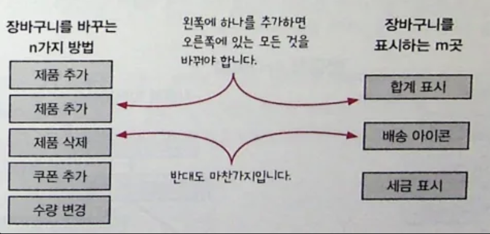
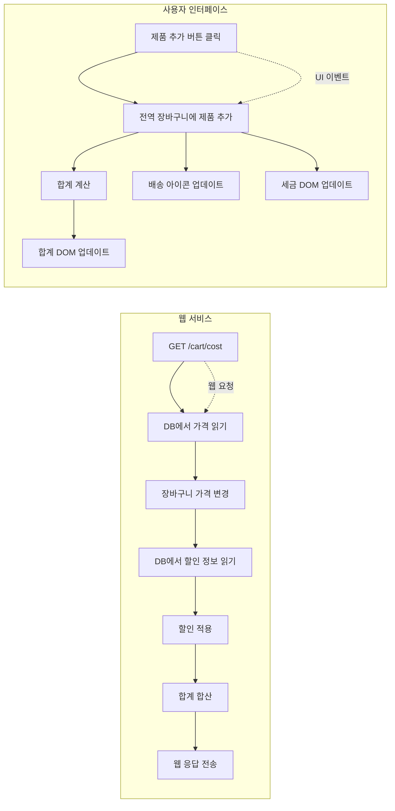
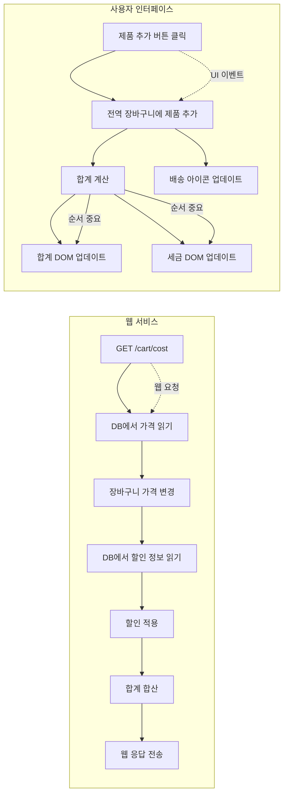
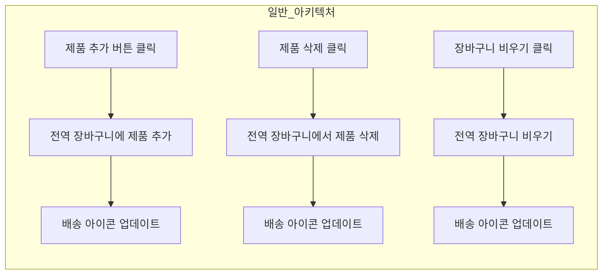
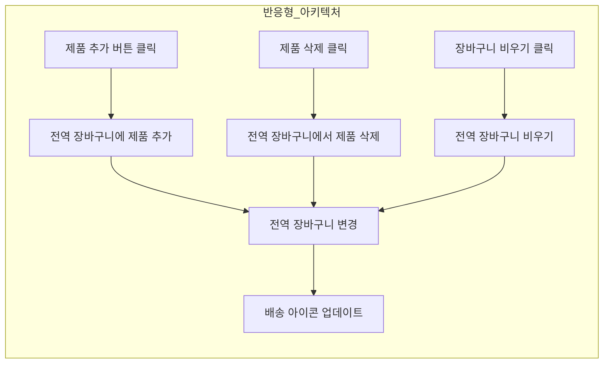
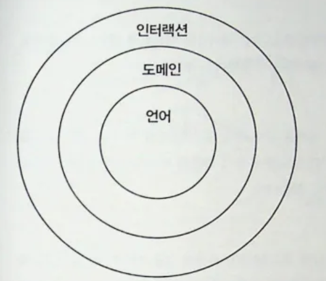
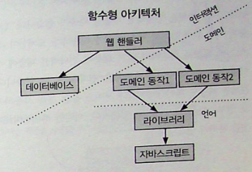

지루한 타임라인 그리기가 끝났습니다…!

물론 액션들을 정리하고, DOM, 비동기 요청들의 타이밍을 정리하는 타임라인들은 재미있었지만..

한 편으로는 정리할 것도 많고 지루했었습니다.

이제는 그것들을 벗어나 아키텍쳐를 한 번 보죠!

## 🤔 반응형 아키텍쳐



프론트엔드 개발자들은 이런 문제를 굉장히 많이 겪습니다. 한 쪽에 뭔가 추가하면 다른 쪽에 있는 것들을 변경하거나 추가해야하는 것들 말이죠!

그래서 반응형 아키텍쳐는 저희가 겪는 것들의 문제들을 해결할 수 있는 방법을 제시하는데요, 반응형 아키텍쳐는 코드에 나타난 순차적 액션의 순서를 뒤집고 효과와 효과에 대한 원인을 분리해서 코드에 복잡하게 꼬인 부분을 풀 수 있다고 하는데… 한 번 알아보죠?!

### 🤩 개념!

이벤트에 대한 반응으로 일어날 일을 지정해 애플리케이션을 구조화하는 방법입니다.

웹 서비스와 UI에 잘 어울립니다.

UI는 버튼 클릭과 같은 이벤트 응답에 일어날 일을 지정하면 되는데, 이런 것을 일반적으로 이벤트 핸들러라고 합니다.





- **이벤트 핸들러 방식** → UI 이벤트 발생 시 이벤트 핸들러가 직접 순차적으로 DOM 업데이트까지 수행
- **반응형 아키텍처 방식** → 전역 상태(장바구니)가 바뀌면 각각의 구독자가 알아서 반응 (합계/세금/배송 아이콘이 독립적으로 업데이트)

이걸 보니 리액트의 업데이트 방식이 떠오릅니다!

절차적으로 스타일의 변경등을 다 명시적으로 했던 것과는 달리 상태를 변경해서 필요한 DOM만 렌더링하는 그런 방식 말이죠~

| 구분              | 이벤트 핸들러 방식                          | 리액트(반응형 아키텍처 유사)                                         |
| ----------------- | ------------------------------------------- | -------------------------------------------------------------------- |
| **업데이트 방식** | UI 이벤트 → 이벤트 핸들러에서 직접 DOM 조작 | UI 이벤트 → **상태(state)** 변경 → 리액트가 필요한 DOM만 다시 렌더링 |

### 🤠 반응형 아키텍쳐의 절충점?

그러나 리액트가 만능이 아니듯 언제 사용하고, 어떻게 사용할지는 우리가 판단해야할 것들입니다..!

결국에 선택은 우리의 몫이라니.. 역시 프로그래밍의 정답은 없는 것 같아요!

### 한 번 적용해볼까요?

### 📝 원래 코드

```jsx
var shopping_cart = ValueCell({});

function add_item_to_cart(name, price) {
  var item = make_cart_item(name, price);
  shopping_cart.update(function (cart) {
    return add_item(cart, item);
  });

  var total = calc_total(shopping_cart.val());
  set_cart_total_dom(total);
  update_tax_dom(total);
}

shopping_cart.addWatcher(update_shipping_icons);
```

### 📝 고친 코드

```jsx
var shopping_cart = ValueCell({});
var cart_total = FormulaCell(shopping_cart, calc_total);

function add_item_to_cart(name, price) {
  var item = make_cart_item(name, price);
  shopping_cart.update(function (cart) {
    return add_item(cart, item);
  });
}

shopping_cart.addWatcher(update_shipping_icons);
cart_total.addWatcher(set_cart_total_dom);
cart_total.addWatcher(update_tax_dom);
```

원래 코드는 `calc_total`을 직접 호출하고 DOM 업데이트를 해주지만,

고친 코드는 `cart_total`이 변할 때마다 DOM을 알아서 업데이트하도록 **watcher**를 등록했습니다.

카트에 담긴 장바구니 총합이 바뀔 때 마다 업데이트 될 수 있도록 말이죠!

이벤트 핸들러 방식과는 완전 다릅니다!

그래서 이벤트 핸들러 방식과는 무엇이 달라지고, 반응형 아키텍쳐는 코드에 어떤 영향을 주는가?!

1. 원인과 효과가 결합된 것이 분리됨.
2. 여러 단계를 파이프라인으로 처리함.
3. 타임라인이 유연해짐.

그럼 이제 반응형 아키텍쳐가 주는 3가지 영향을 알아봅시다.

### 😔 원인과 효과가 결합한 것을 분리합니다

현재 장바구니에 있는 제품이 무료 배송 기준에 맞으면 무료 배송 아이콘을 표시하는 규칙이 있다고 봤을 때. 장바구니라는 것은 언제나 바뀔 수 있고, 장바구니 상태가 바뀔 때 마다 배송 아이콘을 갱신해야합니다.

반응형 아키텍쳐를 사용하면 원인과 효과가 결합한 것을 분리할 수 있습니다.

### 일반적인 아키텍쳐

일반적인 아키텍쳐에서는 장바구니를 바꾸는 모든 UI 이벤트 핸들러에 같은 코드를 넣어서 제품추가, 삭제, 장바구니 비우기에도 배송 아이콘 업데이트하는 코드를 넣습니다.



### 반응형 아키텍쳐

하지만 반응형 아키텍쳐는 배송 아이콘 갱신을 하나만 만들어서, 어떤 이유로든 장바구니가 바뀔 때

배송아이콘을 갱신합니다.



## 🙏🏻 결합의 분리는 원인과 효과의 중심을 관리합니다.

방금은 원인과 효과를 분리해봤는데, 여기서는 장바구니를 바꾸는 방법과, 장바구니가 바뀔 때 해야할 일이 많은 것을 해결해봅시다.

| 장바구니를 바꾸는 방법 | 장바구니가 바뀔 때 해야 할 액션  |
| ---------------------- | -------------------------------- |
| 1. 제품 추가           | 1. 배송 아이콘 업데이트          |
| 2. 제품 삭제           | 2. 세금 표시                     |
| 3. 장바구니 비우기     | 3. 합계 표시                     |
| 4. 수량 변경           | 4. 장바구니에 제품 개수 업데이트 |
| 5. 할인 코드 적용      |                                  |

장바구니가 바뀔 때 해야할 일을 하나 추가를 한다면, 고쳐야 할 것들이 너무 많습니다.

장바구니가 바뀔 때 해야할 액션들이 너무 많기 때문이죠.

원인과 결과가 모두 연결되어있어 관리해야할 것들이 늘어나지 않도록 해야합니다.

원인(데이터의 변경) 결과(UI의 변경)을 분리하여 원인을 추가해도 관리 해야할 것은 하나만 늘어날 수 있게 할 수 있습니다.

예를 들어서 리액트의 비즈니스로직과 UI를 분리하는.. 이렇게 이해할 수 잇겠죠?

### 😆 여러 단계를 파이프라인으로 처리합니다.

어떤 일이 발생하는 여러 단계가 있다면 파이프라인으로 처리하는 것이 좋습니다.

각 단계에서 생성된 데이터는 다음 단계의 입력값으로 사용됩니다.

```jsx
import { useMemo } from "react";

export function useCartTotal(cart: CartItem[]) {
  return useMemo(() => {
    return cart
      .map((item) => ({ ...item, subtotal: item.price * item.quantity }))
      .map((item) => ({
        ...item,
        discounted: item.discount
          ? item.subtotal * (1 - item.discount)
          : item.subtotal,
      }))
      .reduce((sum, item) => sum + item.discounted, 0);
  }, [cart]);
}

function CartSummary({ cart }: { cart: CartItem[] }) {
  const total = useCartTotal(cart);
  return <div>총 합계: {total.toLocaleString()}원</div>;
}
```

데이터의 파이프라인은 훅에서 관리하고, ui는 다르게 사용하는 이런 상황을 예시라고 할 수 있겠습니다!

결론적으로 반응형 아키텍쳐의 **핵심**은 여러 원인이 있고, 그에 따른 여러 효과가 있을 때 사용하면 좋은 아키텍쳐다~~~~!

## 🍎 어니언 아키텍쳐

어니언 아키텍쳐는 현실 세계와 상호작용하기 위한 서비스 구조를 만드는 방법입니다.

어니언 아키텍쳐는 특정 게층이 필요하다고 강제하지 않고, 많은 경우에 3가지 큰 분류로 나눕니다.

## 계층 구조

| 계층          | 설명                                |
| ------------- | ----------------------------------- |
| 인터렉션 계층 | 바깥 세상에 영향을 주거나 받는 액션 |
| 도메인 계층   | 비즈니스 규칙을 정의하는 계산       |
| 언어 계층     | 언어 유틸리티와 라이브러리          |



## 전통적인 계층형 아키텍쳐와 어떻게 다를까?

#### 전통적인 계층형 아키텍처

구조

```
┌─────────────────┐
│   웹 인터페이스    │
├─────────────────┤
│     도메인        │
├─────────────────┤
│  데이터베이스      │
└─────────────────┘
```

특징

웹 인터페이스 계층 : 웹 요청을 도메인으로 바꾸고 도메인을
웹 응답으로 바꿉니다.

도메인 계층 : 애플리케이션 핵심 로직으로 도메인 개념에 DB 쿼리나 명령어가 들어있습니다.

데이터베이스 계층 : 시간에 따라 바뀌는 정보를 저장한다.

데이터베이스 계층이 맨 아래에 있기 때문에 그것들을 호출하기 위한 모든 것들이 액션이 됩니다.

```javascript
// ❌ 전통적인 방식: 모든 계층이 DB에 의존하고 액션만 존재

// 데이터베이스 계층
class UserRepository {
  async findById(id) {
    return await db.query("SELECT * FROM users WHERE id = ?", [id]);
  }

  async updatePoints(id, points) {
    return await db.query("UPDATE users SET points = ? WHERE id = ?", [
      points,
      id,
    ]);
  }
}

// 도메인 계층 (비즈니스 로직 + DB 로직 혼재)
class UserService {
  constructor() {
    this.userRepo = new UserRepository();
  }

  // 액션: DB 의존성으로 인해 테스트하기 어려움
  async purchaseItem(userId, itemPrice) {
    const user = await this.userRepo.findById(userId);

    if (user.points < itemPrice) {
      throw new Error("포인트가 부족합니다");
    }

    const newPoints = user.points - itemPrice;
    await this.userRepo.updatePoints(userId, newPoints);

    return { success: true, remainingPoints: newPoints };
  }
}

// 웹 인터페이스 계층
class UserController {
  constructor() {
    this.userService = new UserService();
  }

  async buyItem(req, res) {
    try {
      const result = await this.userService.purchaseItem(
        req.params.userId,
        req.body.itemPrice
      );
      res.json(result);
    } catch (error) {
      res.status(400).json({ error: error.message });
    }
  }
}
```

#### 함수형 아키텍쳐


액션에서 계산을 빼내고, 명확하게 구분하기 위해서는 도메인 로직은 모두 계산으로 만들어야합니다.

#### 특징

도메인이 중심: 비즈니스 로직이 가장 안쪽

액션과 계산 분리: 도메인은 순수 계산, I/O는 외부 계층

의존성 역전: 바깥에서 안쪽으로만 의존

#### 핵심 규칙

현실 세계 상호작용은 인터렉션 계층에서만

의존성 방향은 항상 중심(안쪽)으로

계층 격리: 내부는 외부 계층을 알지 못함

```javascript
// ✅ 함수형 방식: 계산과 액션 분리, 의존성 역전

// 언어 계층 (순수 계산)
const calculateNewPoints = (currentPoints, itemPrice) => {
  if (currentPoints < itemPrice) {
    return { success: false, error: "포인트가 부족합니다" };
  }

  return {
    success: true,
    newPoints: currentPoints - itemPrice,
    remainingPoints: currentPoints - itemPrice,
  };
};

const validatePurchase = (user, itemPrice) => {
  return user && typeof itemPrice === "number" && itemPrice > 0;
};

// 도메인 계층 (순수한 비즈니스 로직, 계산만)
const purchaseItemLogic = (user, itemPrice) => {
  if (!validatePurchase(user, itemPrice)) {
    return { success: false, error: "잘못된 구매 요청입니다" };
  }

  const result = calculateNewPoints(user.points, itemPrice);

  if (!result.success) {
    return result;
  }

  return {
    success: true,
    userId: user.id,
    newPoints: result.newPoints,
    remainingPoints: result.remainingPoints,
  };
};

// 인터렉션 계층 (액션 - I/O 담당)
class UserRepository {
  async findById(id) {
    return await db.query("SELECT * FROM users WHERE id = ?", [id]);
  }

  async updatePoints(id, points) {
    return await db.query("UPDATE users SET points = ? WHERE id = ?", [
      points,
      id,
    ]);
  }
}

// 애플리케이션 서비스 (액션 - 도메인 로직 조합)
const purchaseItem = async (userId, itemPrice, userRepo) => {
  // 1. 데이터 조회 (액션)
  const user = await userRepo.findById(userId);

  // 2. 비즈니스 로직 실행 (계산)
  const result = purchaseItemLogic(user, itemPrice);

  if (!result.success) {
    return result;
  }

  // 3. 데이터 저장 (액션)
  await userRepo.updatePoints(userId, result.newPoints);

  return result;
};

// 웹 컨트롤러 (액션)
const buyItemController = (userRepo) => async (req, res) => {
  try {
    const result = await purchaseItem(
      req.params.userId,
      req.body.itemPrice,
      userRepo
    );

    if (!result.success) {
      return res.status(400).json({ error: result.error });
    }

    res.json(result);
  } catch (error) {
    res.status(500).json({ error: "서버 오류가 발생했습니다" });
  }
};

// 의존성 주입으로 조합
const userRepo = new UserRepository();
const buyItem = buyItemController(userRepo);
```

액션에서 계산을 빼낸 형태의 조합으로 만들어졌습니다!

## 도메인 규칙은 도메인 용어를 사용합니다.

프로그램의 핵심 로직을 저희는 <strong>비즈니스 로직</strong> 이라는 단어를 자주 쓰는데,

```javascript
var image = newImageDB.getImage("123");
if (image === undefined) image = oldImageDB.getImage("123");
```

이 코드가 비즈니스에 중요한 부분이라고 해도 도메인 로직이 아니기 떄문에 비즈니스 로직은 아니고, 제품,이미지,가격,할인과 같은 용어를 사용해야 비즈니스 로직이다! (++도메인 관련)

### 가독성을 따져 봐
